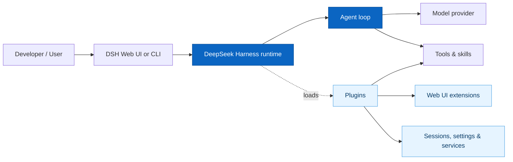
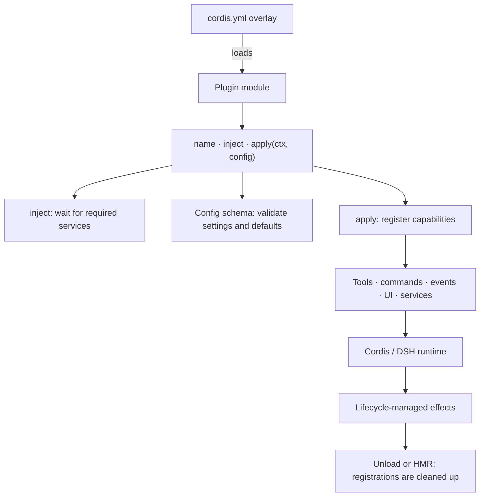
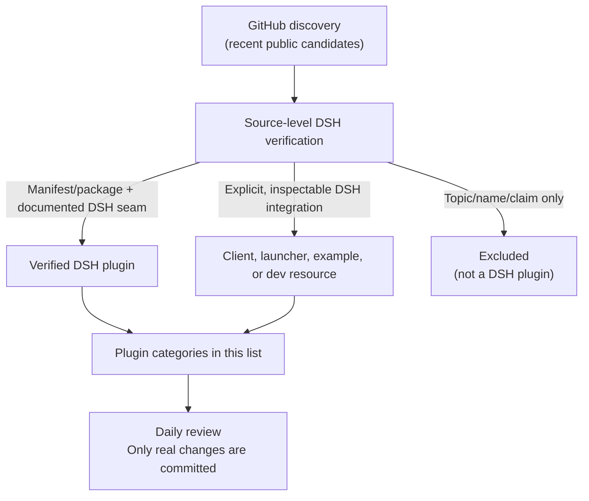
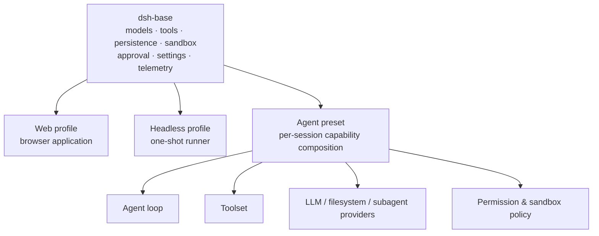
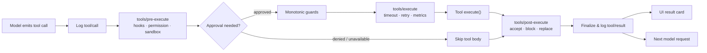
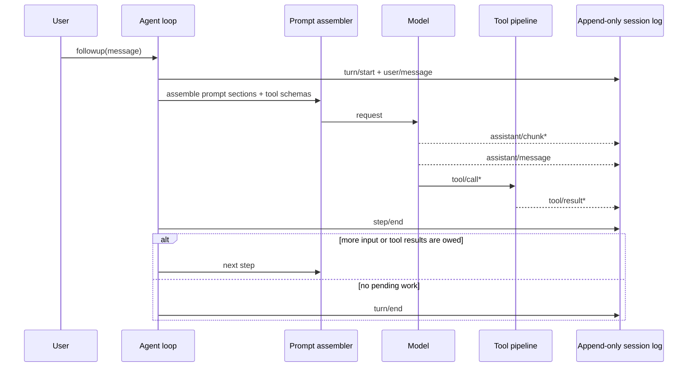
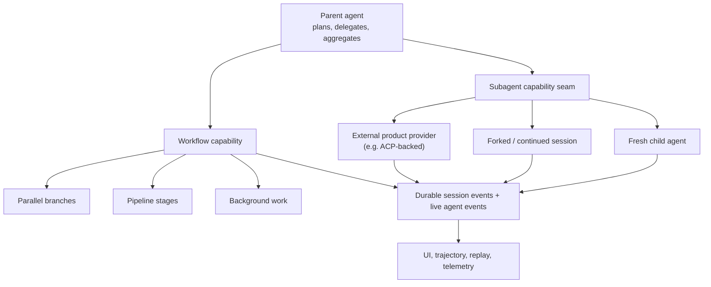
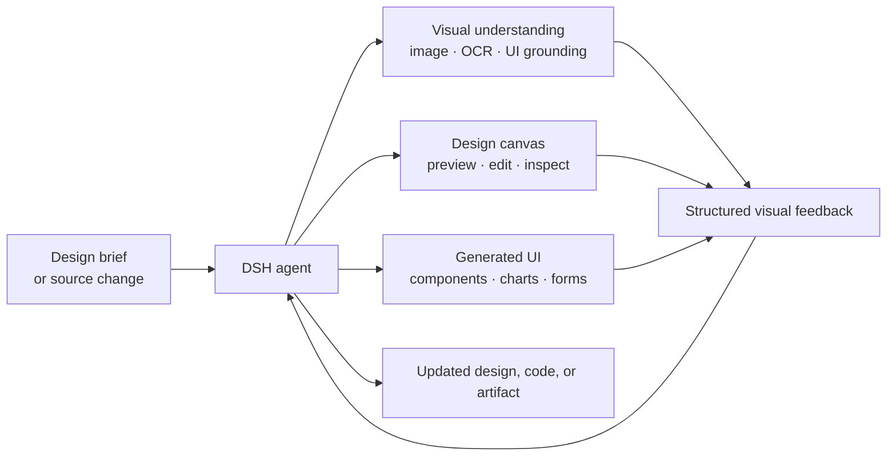

# Awesome DeepSeek Harness Plugins [](https://awesome.re)

English | [简体中文](README.zh.md)

> A curated index of plugins, starters, tools, and primary resources for [DeepSeek Harness (DSH)](https://github.com/deepseek-ai/deepseek-harness).

[DeepSeek Harness](https://github.com/deepseek-ai/deepseek-harness) is DeepSeek AI's open-source, plugin-first agent harness: models, tools, skills, sessions, sandboxes, filesystems, loops, orchestration, and UI can all be composed as plugins.

> **Developer preview** — DSH is changing quickly and may introduce breaking changes. This independent community list is not endorsed by DeepSeek AI or walkinglabs. Review source code and pin a DSH version/commit before installing any third-party plugin. [中文说明](README.zh.md)



## Quick Tutorial — Install DSH and Write Your First Plugin

### 1. Install and run DeepSeek Harness

Install a current [Node.js](https://nodejs.org/) release, then run:

```sh
npx @deepseek-ai/dsh web
```

Open `http://127.0.0.1:3080`. In **Settings → Models**, add a DeepSeek API key; then select a workspace before starting a session. The official [Web UI guide](https://github.com/deepseek-ai/deepseek-harness/blob/master/docs/user/guide/index.md) explains the next steps.

### 2. Create a minimal plugin from source

Plugin development currently starts from an official DSH checkout:

```sh
git clone https://github.com/deepseek-ai/deepseek-harness.git
cd deepseek-harness
pnpm install
pnpm run build
mkdir -p scratch-plugin/src
```

Create `scratch-plugin/src/hello-plugin.ts`:

```ts
import type { Context } from '@deepseek-ai/cordis'

export const name = 'hello-plugin'

export function apply(ctx: Context) {
  console.log('[hello-plugin] loaded')
}
```

Then create `scratch-plugin/cordis.yml`. Replace the path with the absolute path printed by `pwd` in the DSH checkout:

```yaml
- insert:
    - id: hello
      name: '/absolute/path/to/deepseek-harness/scratch-plugin/src/hello-plugin.ts'
```

Run the development overlay:

```sh
pnpm dsh web --patch ./scratch-plugin/cordis.yml
```

When DSH starts, the terminal should show `[hello-plugin] loaded`. This is the smallest valid DSH plugin: export `apply(ctx)` and register capabilities through the Cordis context. To add an agent-callable tool, declare `export const inject = ['tools']` and register it with the documented DSH tool API. Follow the official [first plugin](https://github.com/deepseek-ai/deepseek-harness/blob/master/docs/user/develop/basic/index.md) and [tool-plugin](https://github.com/deepseek-ai/deepseek-harness/blob/master/docs/user/develop/basic/tool.md) tutorials for the complete, current API.

### 3. How the plugin mechanism works



DSH is built on **Cordis**, a runtime composition framework. A plugin is not merely an npm dependency: it is a module that DSH loads into a live context. The plugin declares a `name`, optionally declares `inject` dependencies such as `['tools']`, and exports `apply(ctx, config)`. Cordis waits until injected services are ready, validates any exported `Config` schema and defaults, then invokes `apply`.

Inside `apply`, the plugin can register a tool for the agent, a human command, a settings schema, event listeners, Web UI components, or a service for other plugins. Registrations are lifecycle-managed effects: on unload or hot replacement after a config edit, Cordis removes old registrations automatically. Use `ctx.effect()` only when your plugin owns a resource needing explicit cleanup, such as a timer or network connection. See the official [configuration guide](https://github.com/deepseek-ai/deepseek-harness/blob/master/docs/user/develop/basic/config.md), [service guide](https://github.com/deepseek-ai/deepseek-harness/blob/master/docs/user/develop/framework/service.md), and [capability seams](https://github.com/deepseek-ai/deepseek-harness/blob/master/docs/capability-seams.md).

### 4. What this awesome list includes



The list distinguishes verified DSH plugins from useful but non-plugin resources such as launchers, clients, and ecosystem directories. See the full [inclusion policy](docs/INCLUSION_POLICY.md) for the evidence required before a new entry is added.

### 5. One runtime, different compositions

DSH profiles are plugin compositions rather than separately maintained products. The official base bundle includes model adapters, tools, persistence, sandbox and approval policy, settings, credentials, and telemetry; Web and headless bundles add different entry surfaces. An agent preset can then give a session a different capability set.



This makes a “mode” primarily a selected plugin graph and policy set. It does not guarantee that every composition is stable or suitable for every task; DSH is still a developer preview.

### 6. Tool calls use one guarded execution pipeline



Plugins can insert policy, observability, timeout, or result-handling behavior at documented stages without editing the Agent Loop. The official pipeline also routes Code Mode's dispatched sub-calls through this same path, preserving the approval, sandbox, and logging boundaries.

### 7. Agent turns, steps, and the append-only session log



The session log is the model-context source of truth: durable events record turns, messages, tool calls/results, and raw stream chunks. Forking, resuming, replay, transcripts, telemetry, and persistence derive from that stream; model-visible content must be reconstructable from it.

### 8. Multi-agent and workflow extension points



DSH provides a hierarchy-oriented delegation surface and workflow components; providers behind the subagent seam can vary. The key architectural point is replaceability and shared observability, not a claim that DSH has invented a new multi-agent paradigm.

## Contents

- [Start Here — Official DSH Resources](#start-here--official-dsh-resources)
- [Install and Discover Plugins](#install-and-discover-plugins)
- [Productivity & Agent Workflow](#productivity--agent-workflow)
- [Context, Memory & Observability](#context-memory--observability)
- [Tools, Integrations & Automation](#tools-integrations--automation)
- [Design & Creative Tools](#design--creative-tools)
- [Browser, Computer Use & Remote Execution](#browser-computer-use--remote-execution)
- [Interfaces & Web UI](#interfaces--web-ui)
- [Developer Tooling](#developer-tooling)
- [Utilities](#utilities)
- [Creative & Personal](#creative--personal)
- [Games & Play](#games--play)
- [Launchers & Clients](#launchers--clients)
- [Ecosystem Indexes](#ecosystem-indexes)
- [Contributing](#contributing)
- [License](#license)

## Start Here — Official DSH Resources

- [DeepSeek Harness](https://github.com/deepseek-ai/deepseek-harness) - Official source repository; the primary reference for releases, issues, and compatibility.
- [Documentation guide](https://deepseek-harness.github.io/deepseek-harness/guide) - Official documentation portal supplied by the DSH project.
- [Run DSH](https://github.com/deepseek-ai/deepseek-harness#run) - Start the local Web UI with `npx @deepseek-ai/dsh web`.
- [Architecture](https://github.com/deepseek-ai/deepseek-harness/blob/master/docs/architecture.md) - How the plugin-first DSH runtime is structured.
- [Capability seams](https://github.com/deepseek-ai/deepseek-harness/blob/master/docs/capability-seams.md) - Extension boundaries for DSH capabilities.
- [Cordis primer](https://github.com/deepseek-ai/deepseek-harness/blob/master/docs/cordis-primer.md) - Introduction to the underlying composability framework.
- [Development guide](https://github.com/deepseek-ai/deepseek-harness/blob/master/docs/development.md) - Build DSH from source and contribute upstream.
- [Defensive patterns](https://github.com/deepseek-ai/deepseek-harness/blob/master/docs/defensive-patterns.md) - Official guidance for safer extensions.
- [Testing](https://github.com/deepseek-ai/deepseek-harness/blob/master/docs/testing.md) - DSH testing approaches.
- [Examples](https://github.com/deepseek-ai/deepseek-harness/tree/master/examples) - Official headless, JSON-RPC, MCP-memory, scheduled-web, and Cordis examples.
- [DeepSeek Harness Discussions](https://github.com/deepseek-ai/deepseek-harness/discussions) - Official feedback and community forum.
- [DeepSeek Harness Discord](https://discord.gg/UZ7VEPkDUn) - Community chat linked by the official repository.

## Install and Discover Plugins

- [GitHub topic: `dsh-plugin`](https://github.com/topics/dsh-plugin) - The official recommended GitHub topic for DSH plugin repositories.
- [Plugin registry](https://github.com/vlln/plugin-registry) - A lightweight repository-plugin console and `make-dsh-plugin` development guide.
- [Plugin workshop](https://github.com/omdsh-dev/dsh-hub-workshop) - Community plugin-marketplace and registry workshop.

### Curation policy

The `dsh-plugin` topic, a `dsh-` repository name, or a README claim alone is **not enough** for an entry in this list. Every new plugin must meet the source-level verification policy in [INCLUSION_POLICY.md](docs/INCLUSION_POLICY.md): a real DSH plugin manifest/package or a verifiable, official DSH extension seam. Discovery runs daily over projects from the previous 48 hours; candidates also undergo static security triage of scripts, dependencies, entrypoints, workflows, and sensitive operations. Only candidates that pass both checks are added. This is not a complete security audit or a compatibility guarantee.

## Productivity & Agent Workflow

- [dsh-worktree](https://github.com/FlashingChen/dsh-worktree) - Permanent Codex-style Git worktrees, agent tools, `/worktree`, and per-repository manifests.
- [dsh-at-file](https://github.com/omdsh-dev/dsh-at-file) - Codex-style `@file` mentions that search a workspace and attach file contents to prompts.
- [dsh-open-in-vscode](https://github.com/omdsh-dev/dsh-open-in-vscode) - Open a DSH workspace directly in VS Code from the Web UI.
- [dsh-plannotator](https://github.com/titanwings/dsh-plannotator) - Anchored plan annotations and structured agent feedback.
- [dsh-daily-progress](https://github.com/omdsh-dev/dsh-daily-progress) - Daily-progress workflow plugin.
- [dsh-revive](https://github.com/omdsh-dev/dsh-revive) - Resume interrupted sessions with a command, tool, and browser control.
- [dsh-book2skill](https://github.com/omdsh-dev/dsh-book2skill) - Five-stage book-to-skill workflow with human approval gates.
- [dsh-loop](https://github.com/vlln/dsh-loop) - Scheduled loops with a `/loop` command, tool, and activity bar.
- [dsh-automation](https://github.com/titanwings/dsh-automation) - Run coding tasks in fresh agent sessions on a schedule.
- [dsh-agent-teams](https://github.com/NanmiCoder/dsh-agent-teams) - AgentTeams integration for DSH.
- [dsh-interconnect](https://github.com/Chinesezjc/dsh-interconnect) - Cross-instance message and event handoff service plus tools.
- [dsh-turn-rewind](https://github.com/Anionex/dsh-turn-rewind) - Restore conversation and workspace state through a persistent change ledger.
- [dsh-undo](https://github.com/LingLambda/dsh-undo) - Context undo/redo around the last completed agent step.
- [dsh-openbiliclaw](https://github.com/whiteguo233/dsh-openbiliclaw) - OpenBiliClaw client integration with recommendation and agent-bridge tools.
- [dsh-chat-import](https://github.com/Nwflower/dsh-chat-import) - Import full-fidelity conversation histories from 13 coding agents (Claude Code / Codex / ChatGPT / Cursor / Gemini / Reasonix / opencode / ZCode / Grok Build / OpenClaw / Pi / Hermes / Kimi) as resumable DeepSeek Harness sessions, with reverse export/sync back to Claude Code.

## Context, Memory & Observability

- [dsh-compaction-instant](https://github.com/KitDoesIt/dsh-compaction-instant) - Offline, deterministic replacement for DSH's basic compaction seam, with recall tools for the append-only session log.
- [dsh-continual-evolve](https://github.com/ZK-Andy/dsh-continual-evolve) - Versioned, auditable, rollback-safe harness state (prompt notes, memories, skills, subagent specs) refined from session trajectories; verified against DSH 0.1.0-rc.6.
- [dsh-cost-meter](https://github.com/Han-1413141/dsh-cost-meter) - Per-session and daily API cost, budget, and official-balance tracking for the DSH Web UI, with a history dashboard and one-click official price sync (built against the current dsh web bundle).
- [dsh-memory-evolve](https://github.com/csyangwen/dsh-memory-evolve) - Cross-session memory, branch awareness, session search, and self-evolving skills.
- [Nowledge Mem for DSH](https://github.com/nowledge-co/nowledge-mem-deepseek-harness) - Community memory-plugin bundle built around Nowledge Mem.
- [dsh-session-search](https://github.com/Tieboyh/dsh-session-search) - Index-free cross-agent session search.
- [dsh-session-health](https://github.com/omdsh-dev/dsh-session-health) - Read-only diagnostics for multi-frame zstd session files.
- [dsh-postmortem](https://github.com/zzh-newlearner/dsh-postmortem) - Local-first failure postmortems for DSH sessions.
- [dsh-context-doctor](https://github.com/Zhenyu98/dsh-context-doctor) - Audit instruction, skill, and tool-schema token cost, duplication, and conflicts.
- [dsh-trace](https://github.com/vibeinging/dsh-trace) - Export DSH turns, model steps, and tool calls to yiTrace over HTTP.
- [dsh-sentinel](https://github.com/fuhefei/dsh-sentinel) - Durable file, command, HTTP, process, and webhook watches that wake an agent.
- [dsh-explain](https://github.com/yuezengwu/dsh-explain) - Local-first learning mode with global learning threads and explainable context.
- [dsh-telemetry-redactor](https://github.com/030611/dsh-telemetry-redactor) - Redacts supported secret patterns from the exported `session-telemetry/record` copy without changing the canonical session log; audited against DSH commit `47f943859bef60e4160492346772ded9b24f765a` and tested with `dsh-session-telemetry` rc.6.
- [dsh-verification-receipt](https://github.com/030611/dsh-verification-receipt) - Writes local JSONL summaries of per-turn tool outcomes and heuristic verification signals without storing prompts, tool arguments, or result text; audited against DSH commit `47f943859bef60e4160492346772ded9b24f765a` and tested with `dsh-session` rc.6.

## Tools, Integrations & Automation
- [dhicoc/dsh-reverse-skill](https://github.com/dhicoc/dsh-reverse-skill) - Complete reverse-skill pack (85 SKILL.md) as a DeepSeek Harness Cordis plugin: reverse engineering, authorized pentesting and security-research skill router.

- [dsh-custom-tool](https://github.com/omdsh-dev/dsh-custom-tool) - Create and manage sandboxed JavaScript tools with a Monaco-based editor.
- [dsh-tool-search](https://github.com/vibeinging/dsh-tool-search) - On-demand tool discovery and progressive schema disclosure.
- [dsh-ssh](https://github.com/UynajGI/dsh-ssh) - Remote execution, SFTP filesystem, ProxyJump, subprocess, and PTY support over SSH.
- [dsh-openmaic](https://github.com/THU-MAIC/dsh-openmaic) - OpenMAIC classrooms, slides, interactive widgets, and Socratic teaching.
- [dsh-deep-research](https://github.com/omdsh-dev/dsh-deep-research) - Adaptive deep-research orchestration workflow.
- [dsh-openai-codex-auth](https://github.com/yoke233/dsh-openai-codex-auth) - OpenAI Codex OAuth login and usage-card integration.
- [dsh-plugin-claude-bridge](https://github.com/YYTbit/dsh-plugin-claude-bridge) - Bring Claude Code memory, skills, and configuration into DSH.
- [dsh-acp-for-bitfun](https://github.com/bobleer/dsh-acp-for-bitfun) - BitFun and DSH ACP integration.

## Design & Creative Tools

DSH design plugins can connect an agent's planning and tool use to visual inspection, canvas editing, generated UI, and image workflows. As with every listing here, install only after reviewing the source and its permissions.



- [dsh-openpencil](https://github.com/ZSeven-W/dsh-openpencil) - OpenPencil integration with multi-frame previews, an interactive canvas, and managed editor workbenches.
- [dsh-genui](https://github.com/omdsh-dev/dsh-genui) - Render interactive components, charts, forms, Mermaid, and 3D scenes inline in replies with an action loop back to the agent.
- [dsh-web-review](https://github.com/CanglongCl/dsh-web-review) - Web preview and element annotation feedback for source editing.
- [dsh-vision-toolkit](https://github.com/Anionex/dsh-vision-toolkit) - Image Q&A, OCR, UI restoration, grounding, pixel diffs, and visual artifacts for DSH.
- [dsh-ernie-image](https://github.com/omdsh-dev/dsh-ernie-image) - DSH image-generation integration packaged with a DSH bundle patch.
- [dsh-visualize](https://github.com/Nagi-ovo/dsh-visualize) - Inline interactive HTML cards rendered in a sandboxed iframe with a constrained CSP and workspace export.
- [dsh-image-to-path](https://github.com/cesaryike/dsh-image-to-path) - Same-origin, size- and magic-byte-checked image paste/drop uploads saved under the active session workspace.

## Browser, Computer Use & Remote Execution

- [ego-browser](https://github.com/Fisfzy/ego-browser) - Chromium agent browser with semantic snapshots, controls, screenshots, CDP, and isolated workspaces.
- [dsh-browser](https://github.com/Lum1104/dsh-browser) - Chrome sidebar extension for direct browser operation without vision capabilities.
- [dsh-better-browser](https://github.com/titanwings/dsh-better-browser) - Signed-in browser access through Kimi WebBridge tools.
- [dsh-computer-use](https://github.com/Anionex/dsh-computer-use) - Accessibility-first macOS computer-use bundle with scoped permissions and freshness checks.

## Interfaces & Web UI

- [dsh-passwords](https://github.com/slywalker2006/dsh-passwords) - Login gateway for remote, multi-user DSH Web access, with HTTPS, quotas, sandbox restrictions, and audit logs.
- [dsh-ux-simple](https://github.com/KhalilYamber/dsh-ux-simple) - A two-mode Web UI that provides plain-language tool-call cards while preserving the native view.
- [dsh-any-background](https://github.com/Tkingxiao/dsh-any-background) - Local-browser theme color, wallpaper, opacity, and blur customization for DSH Web.
- [dsh-tui](https://github.com/orriduck/dsh-tui) - Small session-aware terminal UI.
- [dsh-cc-tui](https://github.com/ccch1mneyyy/dsh-cc-tui) - Claude Code-style full-screen terminal interface.
- [dsh-tianshu-tui](https://github.com/huiliyi37/dsh-tianshu-tui) - Terminal UI for DSH.
- [dsh-grok-tui](https://github.com/chen-001/dsh-grok-tui) - Use DSH through grok-build's TUI.
- [dsh-focus-chat](https://github.com/dingyi222666/dsh-focus-chat) - Reduced chat view that emphasizes final outputs.
- [dsh-working-activity](https://github.com/ccch1mneyyy/dsh-working-activity) - Live status line for model activity and tools.
- [dsh-notification](https://github.com/omdsh-dev/dsh-notification) - Desktop notifications for completed turns with outcome and keyword controls.
- [dsh-session-notification](https://github.com/dingyi222666/dsh-session-notification) - Browser and prompt notifications for four session states.
- [dsh-deeplink](https://github.com/qyw233/dsh-deeplink) - Open a specified session or workspace directly from a Web UI URL.
- [dsh-navbar](https://github.com/vlln/dsh-navbar) - Right-edge conversation-node navigation.
- [dsh-task-status](https://github.com/vlln/dsh-task-status) - Background task progress and live-output status bar.
- [dsh-spotlight](https://github.com/0xsline/dsh-spotlight) - Keyboard-first command palette for DSH Web.
- [dsh-sticky-disclosure](https://github.com/Han-1413141/dsh-sticky-disclosure) - One-click collapse of every expanded section in the Web UI (Think rows, tool cards) with a live count and a customizable hotkey. Compatible with DSH 0.1.0-rc.6.
- [dsh-paste-input](https://github.com/lhh010/dsh-paste-input) - Clipboard paste, drag-and-drop, and file-picker enhancements.
- [dsh-input-history](https://github.com/lhh010/dsh-input-history) - Terminal-style input history navigation.
- [dsh-ui-progress](https://github.com/lhh010/dsh-ui-progress) - Session progress, generation speed, interruption, and todo indicators.

## Developer Tooling

- [Code2Skill](https://github.com/leechen298/Code2Skill) - DSH bundle of three skills that generate and review Function, MCP, and Agent Skill packages from authorized source code (version-pinned at v1.1.3).
- [dsh-plugin-skills](https://github.com/omdsh-dev/dsh-plugin-skills) - Agent skills for scaffolding and testing DSH plugins.
- [dsh-plugin-dev](https://github.com/omdsh-dev/dsh-plugin-dev) - Practical plugin-development notes on Cordis, TypeScript, Windows junctions, and sessions.
- [dsh-plugin-check](https://github.com/omdsh-dev/dsh-plugin-check) - Read-only plugin repository health checks for manifests, patches, and build pitfalls.
- [dsh-security-audit](https://github.com/omdsh-dev/dsh-security-audit) - Read-only local audit of configuration, plugin provenance, sessions, and network exposure.
- [dsh-scout](https://github.com/omdsh-dev/dsh-scout) - Read-only environment discovery: software, resources, ports, services, hardware, and workspace.
- [dsh-bash-rtk](https://github.com/DeepTrial/dsh-bash-rtk) - Routes eligible bash commands through rtk (Rust Token Killer) inside the DSH bash executor to compress tool output and save tokens; safe passthrough when rtk is absent.
- [dsh-bash-encoding](https://github.com/lhh010/dsh-bash-encoding) - Better decoding for UTF-16LE, UTF-8, GBK, and other Bash output encodings.
- [dsh-tool-approval](https://github.com/ilharp/dsh-tool-approval) - Manual/ask-mode approval for DSH tools.

## Utilities

- [dsh-toolkit](https://github.com/omdsh-dev/dsh-toolkit) - Zero-dependency collection for time, encoding, JSON, calculation, CSV, regex, Markdown, diff, statistics, and schema tools.
- [dsh-tool-time](https://github.com/omdsh-dev/dsh-tool-time) - ISO 8601, IANA timezone, UTC-calendar, and duration utilities.
- [dsh-tool-json](https://github.com/omdsh-dev/dsh-tool-json) - Zero-dependency JMESPath-subset JSON querying.
- [dsh-tool-schema](https://github.com/omdsh-dev/dsh-tool-schema) - JSON Schema validation, path inspection, explanations, and normalization.
- [dsh-tool-regex](https://github.com/omdsh-dev/dsh-tool-regex) - Safe regex testing, extraction, replacement, and static explanation.
- [dsh-tool-csv](https://github.com/omdsh-dev/dsh-tool-csv) - RFC 4180 parsing, querying, statistics, and conversion.
- [dsh-tool-markdown](https://github.com/omdsh-dev/dsh-tool-markdown) - HTML/Markdown conversion, GFM table normalization, and table-of-contents generation.
- [dsh-tool-diff](https://github.com/omdsh-dev/dsh-tool-diff) - Structured text, JSON, CSV, and Markdown comparisons.
- [dsh-tool-stat](https://github.com/omdsh-dev/dsh-tool-stat) - Descriptive statistics, percentiles, distributions, and correlation.
- [dsh-tool-calculator](https://github.com/omdsh-dev/dsh-tool-calculator) - Safe mathematical-expression evaluator.
- [dsh-tool-encoding](https://github.com/omdsh-dev/dsh-tool-encoding) - Base64, URL, hex, hash, and UUID utilities.

## Creative & Personal

- [dsh-annotation](https://github.com/omdsh-dev/dsh-annotation) - Select text, attach annotations, and send structured feedback with a message.
- [dsh-prompt-studio](https://github.com/Moeblack/dsh-prompt-studio) - Edit user and system-prompt sections with live preview.
- [dsh-ui-whale](https://github.com/lhh010/dsh-ui-whale) - Animated pixel-whale companion for the Web UI.
- [whale-girl](https://github.com/vlln/whale-girl) - Config-installable desktop-pet repository plugin.
- [dsh-pet-corner](https://github.com/omdsh-dev/dsh-pet-corner) - Floating pet, image proxy, favorites, and plugin-owned settings.
- [dsh-fun-weather](https://github.com/omdsh-dev/dsh-fun-weather) - Open-Meteo weather tab and weather-following themes.
- [dsh-fun-ticker](https://github.com/omdsh-dev/dsh-fun-ticker) - Configurable crypto, FX, A-share, index, and stock ticker.
- [dsh-fun-typewriter](https://github.com/omdsh-dev/dsh-fun-typewriter) - WebAudio typing ambience with plugin settings.

## Games & Play

- [dsh-minigames](https://github.com/lhh010/dsh-minigames) - An offline DSH Web side panel with 18 mini-games, including Dino, Tetris, Tanks, Gomoku, and Minesweeper.

## Launchers & Clients

- [dsh-launcher](https://github.com/Ruler4396/dsh-launcher) - Lightweight Windows autostart launcher with a minimal WebView2 window.
- [dsh-launcher](https://github.com/SnowCrescenter-tech/dsh-launcher) - Portable Windows one-click launcher without a Node.js setup.
- [DSHgo](https://github.com/Asuta/DSHgo) - Windows desktop launcher and profile manager.
- [dsh-desktop](https://github.com/bruc3van/dsh-desktop) - Electron desktop client with workspace, session-sharing, remote, and tray support.
- [orbis](https://github.com/icodesign/orbis) - Mobile remote-control client for DeepSeek Harness.
- [oh-dsh-desktop](https://github.com/hust-open-atom-club/oh-dsh-desktop) - Extensible macOS workbench with native PTY, workspace tools, and isolated preview marketplace.

## Ecosystem Indexes

These are community indexes rather than individual plugins; use them as secondary discovery sources and verify entries yourself.

- [awesome-dsh-plugin](https://github.com/awesome-dsh-plugin/awesome-dsh-plugin) - Community-curated DSH plugin list.
- [awesome-dsh-plugin](https://github.com/bruc3van/awesome-dsh-plugin) - Bilingual DSH plugin index.
- [awesome-DSH-plugin](https://github.com/Alex-Yanggg/awesome-DSH-plugin) - Curated DSH extensions and development resources.
- [awesome-deepseek-harness](https://github.com/Dominic789654/awesome-deepseek-harness) - DSH plugins, skills, MCP servers, orchestrators, and UIs.
- [dsh-suite](https://github.com/whyihaveyou/dsh-suite) - Bilingual directory with daily compatibility CI and a scaffold.
- [oh-my-dsh](https://github.com/wangshunnn/oh-my-dsh) - DSH plugin collection.
- [oh-my-dsh](https://github.com/LaplaceYoung/oh-my-dsh) - Large DSH extension ecosystem catalog.

## Contributing

Contributions are welcome. Please read [CONTRIBUTING.md](CONTRIBUTING.md) before opening a pull request.

## License

To the extent possible under law, the maintainers have waived all copyright and related rights to this work under [CC0 1.0](LICENSE).
