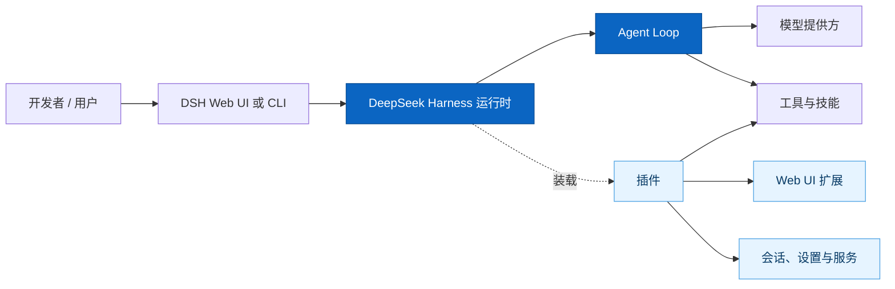
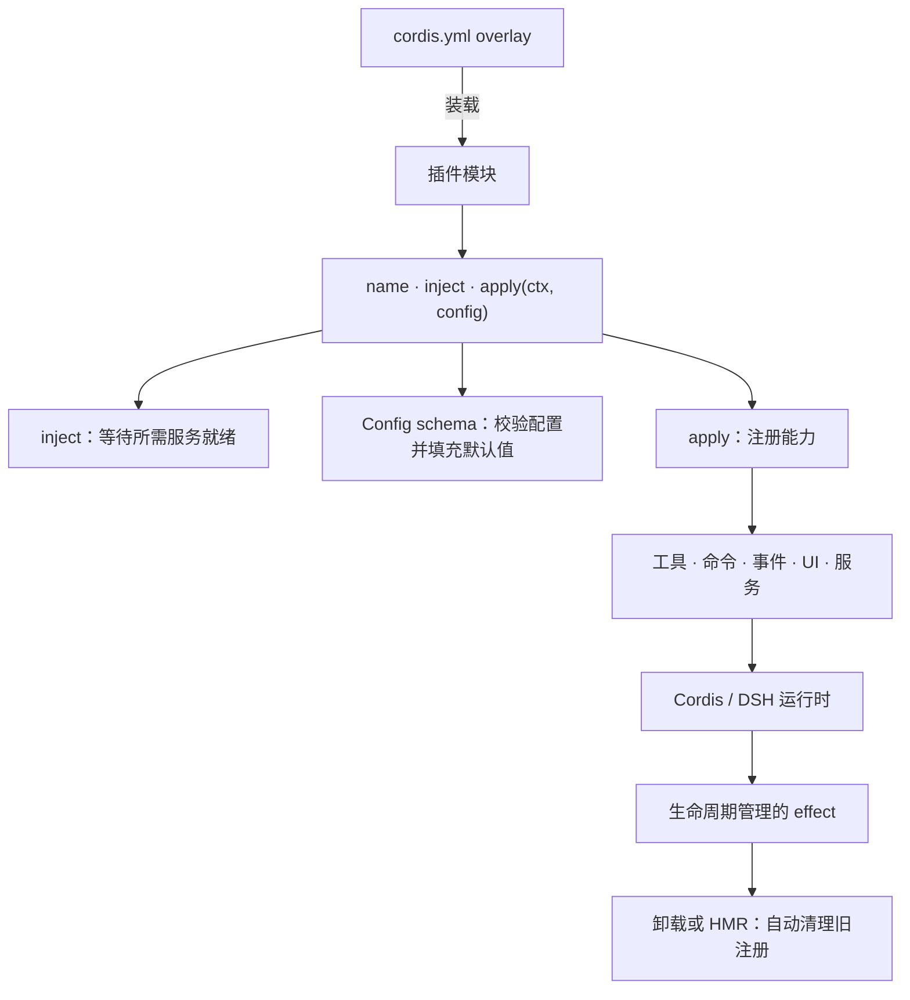
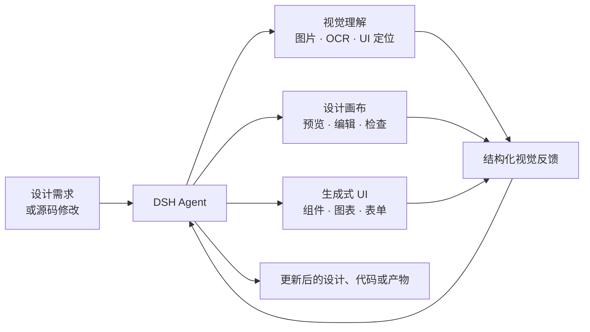
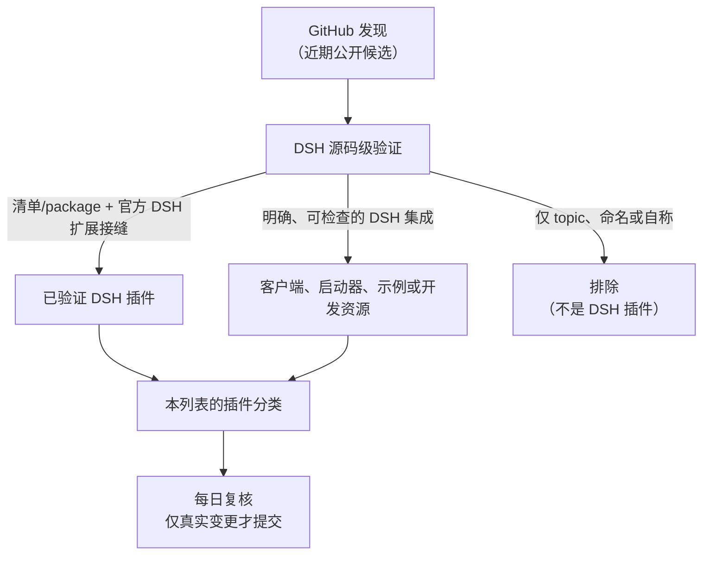
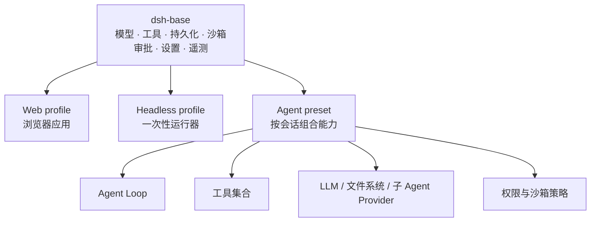
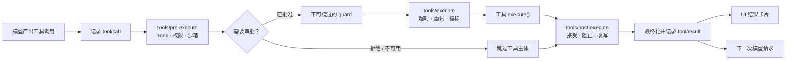
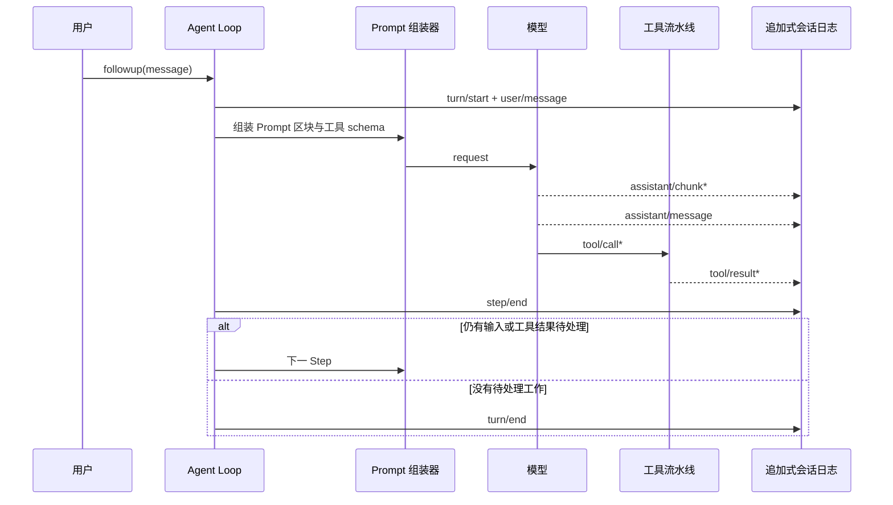
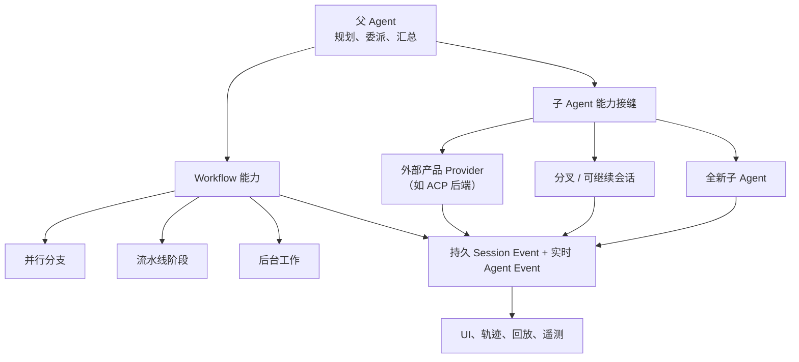

# Awesome DeepSeek Harness Plugins [](https://awesome.re)

[English](README.md) | 简体中文

> 面向 [DeepSeek Harness（DSH）](https://github.com/deepseek-ai/deepseek-harness) 的插件、插件起步项目、工具与一手资料精选索引。

DeepSeek Harness 是 DeepSeek AI 开源的插件优先 Agent Harness：模型、工具、技能、会话、沙箱、文件系统、循环、编排和界面都可以作为插件组合。完整英文目录见 [README.md](README.md)；两个入口维护同一套严格收录标准。

> **开发者预览版**：DSH 迭代很快，可能出现破坏性变更。本仓库是独立社区整理，不代表 DeepSeek AI 或 walkinglabs 的背书。安装第三方插件前请审查源码，并固定 DSH 版本或 commit。



## 快速教程：安装 DSH 并写出第一个插件

### 1. 安装并运行 DeepSeek Harness

先安装当前版本的 [Node.js](https://nodejs.org/)，然后执行：

```sh
npx @deepseek-ai/dsh web
```

打开 `http://127.0.0.1:3080`。在 **Settings → Models** 中填写 DeepSeek API Key；再选择一个工作区，即可开始会话。更多步骤见官方 [Web UI 使用指南](https://github.com/deepseek-ai/deepseek-harness/blob/master/docs/user/guide/index.md)。

### 2. 从源码创建最小插件

当前官方插件开发流程需要先获得 DSH 源码：

```sh
git clone https://github.com/deepseek-ai/deepseek-harness.git
cd deepseek-harness
pnpm install
pnpm run build
mkdir -p scratch-plugin/src
```

创建 `scratch-plugin/src/hello-plugin.ts`：

```ts
import type { Context } from '@deepseek-ai/cordis'

export const name = 'hello-plugin'

export function apply(ctx: Context) {
  console.log('[hello-plugin] loaded')
}
```

再创建 `scratch-plugin/cordis.yml`。把下方路径替换成在 DSH 源码目录执行 `pwd` 后得到的绝对路径：

```yaml
- insert:
    - id: hello
      name: '/absolute/path/to/deepseek-harness/scratch-plugin/src/hello-plugin.ts'
```

使用这个 overlay 启动：

```sh
pnpm dsh web --patch ./scratch-plugin/cordis.yml
```

DSH 启动后，终端应显示 `[hello-plugin] loaded`。这就是最小的 DSH 插件：导出 `apply(ctx)`，并通过 Cordis 上下文注册能力。若要添加 Agent 可调用的工具，请声明 `export const inject = ['tools']`，再通过官方 DSH 工具 API 注册。完整且随版本更新的写法请查看官方[第一个插件教程](https://github.com/deepseek-ai/deepseek-harness/blob/master/docs/user/develop/basic/index.md)和 [Tool 插件教程](https://github.com/deepseek-ai/deepseek-harness/blob/master/docs/user/develop/basic/tool.md)。

### 3. 插件机制如何工作



DSH 基于 **Cordis**，后者是一个运行时组合框架。插件不只是一个 npm 依赖包，而是 DSH 会装载到运行中上下文的模块。它声明 `name`，可选声明 `inject` 依赖（例如 `['tools']`），并导出 `apply(ctx, config)`。Cordis 会等待 `inject` 所需服务准备完成，校验导出的 `Config` schema 并填充默认值，然后调用 `apply`。

在 `apply` 内，插件可以注册供 Agent 调用的工具、供人使用的命令、设置 schema、事件监听器、Web UI 组件，或提供给其他插件的服务。这些注册是由生命周期管理的 effect：配置修改触发热替换，或插件卸载时，Cordis 会自动移除旧注册。只有当插件自行持有需要显式释放的资源（如定时器、网络连接）时，才使用 `ctx.effect()` 返回清理函数。详见官方[配置指南](https://github.com/deepseek-ai/deepseek-harness/blob/master/docs/user/develop/basic/config.md)、[服务指南](https://github.com/deepseek-ai/deepseek-harness/blob/master/docs/user/develop/framework/service.md)及[能力接缝说明](https://github.com/deepseek-ai/deepseek-harness/blob/master/docs/capability-seams.md)。

### 4. 设计与创意工具 / Design & Creative Tools

DSH 的设计类插件可将 Agent 的规划和工具调用连接到视觉理解、设计画布、界面生成与图像工作流。与其他条目一样，安装前请审查源码和所需权限。



- [dsh-openpencil](https://github.com/ZSeven-W/dsh-openpencil) - 多帧预览、交互式画布与受管理编辑器工作台。 / Multi-frame previews, an interactive canvas, and managed editor workbenches.
- [dsh-genui](https://github.com/omdsh-dev/dsh-genui) - 在回复中渲染交互组件、图表、表单、Mermaid 与 3D 场景，并回传操作事件。 / Inline generated UI with an action loop.
- [dsh-web-review](https://github.com/CanglongCl/dsh-web-review) - 网页预览与元素批注反馈，帮助 Agent 改源码。 / Web preview and annotated visual feedback for source editing.
- [dsh-vision-toolkit](https://github.com/Anionex/dsh-vision-toolkit) - 图片问答、OCR、UI 还原、定位、像素差分与视觉产物。 / Image Q&A, OCR, UI restoration, grounding, and pixel diffs.
- [dsh-ernie-image](https://github.com/omdsh-dev/dsh-ernie-image) - 以 DSH bundle patch 打包的图像生成集成。 / Image-generation integration packaged for DSH.
- [dsh-visualize](https://github.com/Nagi-ovo/dsh-visualize) - 在受限 CSP 的沙箱 iframe 中渲染行内交互 HTML 卡片，并导出到工作区。 / Inline interactive HTML cards in a sandboxed iframe with constrained CSP and workspace export.
- [dsh-image-to-path](https://github.com/cesaryike/dsh-image-to-path) - 仅同源、具备大小与图片魔数校验的粘贴/拖放上传，保存到当前会话工作区。 / Same-origin image paste/drop uploads with size and magic-byte checks, saved in the active session workspace.

### 5. 这个 Awesome 仓库收录什么



本仓库会区分“已验证 DSH 插件”与启动器、客户端、生态目录等“有用但非插件”的资源。新增条目需要的证据详见[完整收录规范](docs/INCLUSION_POLICY.md)。

### 5. 同一运行时，不同插件组合

DSH 的 profile 是插件组合，而不是分别维护的多套产品。官方基础 bundle 包含模型适配器、工具、持久化、沙箱与审批策略、设置、凭据和遥测；Web 与 headless bundle 在此基础上增加不同的入口界面；Agent preset 还能为单个会话选择不同的能力集合。



因此，“模式”主要是某一套插件图与策略集的选择，而不是另一套独立产品。这不保证每种组合都稳定或适合每项任务；DSH 仍处于开发者预览阶段。

### 6. 工具调用走同一条受控执行流水线



插件可以在官方规定的阶段插入策略、可观测性、超时或结果处理，而无需修改 Agent Loop。官方流水线也让 Code Mode 分派的子调用通过同一条路径，从而保留审批、沙箱和日志边界。

### 7. Agent 的 Turn、Step 与追加式会话日志



会话日志是模型上下文的事实来源：它持久记录 turn、消息、工具调用/结果和原始流式 chunk。分叉、恢复、回放、转录、遥测与持久化都从该事件流派生；任何模型可见内容都必须能从中重建。

### 8. 多 Agent 与 Workflow 扩展接缝



DSH 提供了以层级委派为主的表面与 workflow 组件；子 Agent 接缝后的 provider 可以替换。其架构关键在于可替换性和共享可观测性，而不是声称创造了全新的多 Agent 范式。

## 快速开始：官方 DSH 资料

- [DeepSeek Harness 官方源码](https://github.com/deepseek-ai/deepseek-harness) - 版本、issue 与兼容性的唯一首要依据。
- [官方文档指南](https://deepseek-harness.github.io/deepseek-harness/guide) - DSH 官方文档入口。
- [运行 DSH](https://github.com/deepseek-ai/deepseek-harness#run) - 通过 `npx @deepseek-ai/dsh web` 启动本地 Web UI。
- [架构](https://github.com/deepseek-ai/deepseek-harness/blob/master/docs/architecture.md) - 了解插件优先运行时的结构。
- [能力接缝](https://github.com/deepseek-ai/deepseek-harness/blob/master/docs/capability-seams.md) - 官方定义的扩展边界。
- [Cordis 入门](https://github.com/deepseek-ai/deepseek-harness/blob/master/docs/cordis-primer.md) - DSH 所依赖的可组合框架。
- [开发指南](https://github.com/deepseek-ai/deepseek-harness/blob/master/docs/development.md) - 从源码构建及贡献官方项目。
- [防御性模式](https://github.com/deepseek-ai/deepseek-harness/blob/master/docs/defensive-patterns.md) - 更安全地扩展 DSH 的官方建议。
- [测试](https://github.com/deepseek-ai/deepseek-harness/blob/master/docs/testing.md) - 官方测试方式。
- [官方示例](https://github.com/deepseek-ai/deepseek-harness/tree/master/examples) - Headless、JSON-RPC、MCP Memory、定时 Web、Cordis 示例。

## 如何找插件

- [GitHub `dsh-plugin` topic](https://github.com/topics/dsh-plugin) - 官方建议用于 DSH 插件发现的 topic；**仅用于发现，不构成收录证据**。
- [插件注册表](https://github.com/vlln/plugin-registry) - Repository-plugin 控制台和 `make-dsh-plugin` 开发指导。
- [插件工作坊](https://github.com/omdsh-dev/dsh-hub-workshop) - 社区插件市场和注册表实践。

## 收录保证

我们不因为名称、topic 或 README 自称 DSH 插件就收录。每个新插件都必须通过[源码级收录规范](docs/INCLUSION_POLICY.md)：存在真实 DSH 清单/插件包，或能在官方 DSH 扩展接缝中验证的实现。每日只检索过去 48 小时的新/更新项目，并对脚本、依赖、入口、工作流及敏感操作做静态安全初筛；只有两项都通过才会收录。没有合格候选就不修改仓库。这不是完整安全审计或兼容性保证。

## 完整目录 / Full index

[英文完整目录](README.md) 按下列分类维护项目的英文说明；每一类均只收录符合上述 DSH 规则的项目：

- 生产力与 Agent 工作流 / Productivity & Agent Workflow
- 上下文、记忆与可观测性 / Context, Memory & Observability
- 工具、集成与自动化 / Tools, Integrations & Automation
- 设计与创意工具 / Design & Creative Tools
- 浏览器、计算机操作与远程执行 / Browser, Computer Use & Remote Execution
- 终端与 Web 界面 / Interfaces & Web UI
- 开发工具 / Developer Tooling
- 实用工具 / Utilities
- 创意与个性化 / Creative & Personal
- 游戏与游玩 / Games & Play
- 启动器与客户端（不是插件）/ Launchers & Clients (not plugins)
- 生态目录（不是插件）/ Ecosystem Indexes (not plugins)

### 游戏与游玩 / Games & Play

- [dsh-minigames](https://github.com/lhh010/dsh-minigames) - DSH Web 右侧离线小游戏面板，包含恐龙跳一跳、俄罗斯方块、坦克大战、五子棋、扫雷等 18 款游戏。 / An offline DSH Web side panel with 18 mini-games, including Dino, Tetris, Tanks, Gomoku, and Minesweeper.

### 近期通过核验的新增 / Recently verified additions

- [dsh-reviewer-bot](https://github.com/chaojixinren/dsh-reviewer-bot) - 面向 GitHub 与 GitLab 的可配置 DSH 原生代码评审 bundle，写操作默认拒绝，并支持本地回放。 / Configurable DSH-native code-review bundle for GitHub and GitLab, with fail-closed write mode and local replay support.
- [dsh-reasoning-effort](https://github.com/HanaAyane/dsh-reasoning-effort) - 遵循模型适配器实际声明档位的 Codex 风格会话模型与思考强度选择器，并为自定义 provider 提供只读声明指引。 / Codex-style session model and reasoning-effort selector that follows adapter-advertised levels, with read-only guidance for custom-provider declarations.
- [dsh-auto-mode](https://github.com/NanmiCoder/dsh-auto-mode) - 默认拒绝的自动权限策略，含受保护路径与凭据检查；歧义工具调用会使用脱敏后的分类器兜底。 / Fail-closed automatic-permission policy with protected-path and credential checks, plus a redacted classifier fallback for ambiguous tool calls.
- [dsh-toy](https://github.com/c3ll256/dsh-toy) - 通过 Intiface 或 MonsterParty 控制兼容个人设备；可选 Intiface 助手会在缺失时下载固定版本、经 SHA-256 校验的上游引擎。 / Control compatible personal devices through Intiface or MonsterParty; the optional helper downloads a pinned, SHA-256-verified upstream engine when absent.
- [Tabbit Browser for DSH](https://github.com/Tabbit-Browser/dsh-plugin) - 浏览器自动化 Skill，支持通过显式工具在所需浏览器缺失或过期时下载对应地区的 Tabbit Browser 安装器。 / Browser-automation skill with an explicit tool that can download the region-appropriate Tabbit Browser installer when the supported browser is absent or outdated.
- [Code2Skill](https://github.com/leechen298/Code2Skill) - 从已授权源码生成并复核 Function、MCP 与 Agent Skill 包的 3 个 DSH Skills bundle（固定版本 v1.1.3）。 / A three-skill DSH bundle for generating and reviewing Function, MCP, and Agent Skill packages from authorized source code (version-pinned at v1.1.3).
- [dsh-passwords](https://github.com/slywalker2006/dsh-passwords) - 面向远程、多用户 DSH Web 的登录网关，提供 HTTPS、配额、沙箱限制与审计日志。 / Login gateway for remote, multi-user DSH Web access, with HTTPS, quotas, sandbox restrictions, and audit logs.
- [dsh-compaction-instant](https://github.com/KitDoesIt/dsh-compaction-instant) - 离线、确定性的 DSH 基础上下文压缩替代实现，并提供 append-only 会话日志的回溯工具。 / Offline deterministic replacement for the DSH basic compaction seam, with append-only-log recall tools.
- [dsh-cost-meter](https://github.com/Han-1413141/dsh-cost-meter) - 会话与当日 API 费用、预算与官方余额统计（DSH Web），带历史看板与官方价格一键同步（峰谷计价）。 / Per-session and daily API cost, budget, and official-balance tracking for the DSH Web UI, with a history dashboard and one-click official price sync (peak/off-peak pricing).
- [dsh-visualize](https://github.com/Nagi-ovo/dsh-visualize) - 受限 CSP 的沙箱可视化卡片。 / Sandboxed visualization cards with a constrained CSP.
- [dsh-image-to-path](https://github.com/cesaryike/dsh-image-to-path) - 带同源、大小与图片类型检查的工作区图片上传。 / Workspace image upload with same-origin, size, and image-type checks.
- [dsh-ux-simple](https://github.com/KhalilYamber/dsh-ux-simple) - 保留原生界面的同时，提供两档工具调用卡片与白话说明。 / Two-mode tool-call cards with plain-language explanations while preserving the native view.
- [dsh-any-background](https://github.com/Tkingxiao/dsh-any-background) - 在本地浏览器保存主题色、壁纸、透明度与模糊度设置。 / Local-browser theme color, wallpaper, opacity, and blur customization.
- [dsh-telemetry-redactor](https://github.com/030611/dsh-telemetry-redactor) - 对导出的 `session-telemetry/record` 副本脱敏已支持的秘密模式，不改写权威会话日志；以 DSH 提交 `47f943859bef60e4160492346772ded9b24f765a` 为审计基线，并用 `dsh-session-telemetry` rc.6 实测。 / Redacts supported secret patterns from exported telemetry copies without changing the canonical session log; audited against DSH commit `47f943859bef60e4160492346772ded9b24f765a` and tested with `dsh-session-telemetry` rc.6.
- [dsh-verification-receipt](https://github.com/030611/dsh-verification-receipt) - 将每轮工具结果与启发式验证信号摘要写入本地 JSONL，不保存提示词、工具参数或结果正文；以 DSH 提交 `47f943859bef60e4160492346772ded9b24f765a` 为审计基线，并用 `dsh-session` rc.6 实测。 / Writes local JSONL summaries of per-turn tool outcomes and heuristic verification signals without storing prompts, tool arguments, or result text; audited against DSH commit `47f943859bef60e4160492346772ded9b24f765a` and tested with `dsh-session` rc.6.
- [dhicoc/dsh-reverse-skill](https://github.com/dhicoc/dsh-reverse-skill) - 完整 reverse-skill（85 个 SKILL.md）的 DSH 技能路由包，覆盖逆向工程、授权渗透测试与安全研究。 / An 85-skill DSH router pack for reverse engineering, authorized penetration testing, and security research.
- [dsh-context](https://github.com/bowenliang123/dsh-context) - 上下文洞察面板：一眼看清模型上下文窗口的组成与变化——构成对照窗口大小、按请求历史趋势、压缩/注入事件、消息级 token 统计。 / Context insight panel: see what the model's context window is made of and how it evolves — composition vs. window size, per-request history, compression/injection events, and per-message token stats.
- [dsh-bell-notify](https://github.com/Laplace-bit/dsh-bell-notify) - 生命周期铃声 + 状态点：为每个环节（启动、工具调用、命令、等待审批、回合完成、空闲）播放专属提示音，Web Audio 实时合成零音频文件，可上传自定义音；经 `dsh.bundle` manifest 与 Cordis patch 声明安装。 / Per-lifecycle-event chimes for DSH, synthesized live with Web Audio (zero audio files), plus a breathing status dot; declarable via a `dsh.bundle` manifest with a Cordis patch.

## 贡献

请阅读[中文贡献指南](CONTRIBUTING.zh.md)或[English guide](CONTRIBUTING.md)。提交条目时，请提供源码中 DSH 集成的具体证据。

## 许可证

本仓库采用 [CC0 1.0](LICENSE)。
