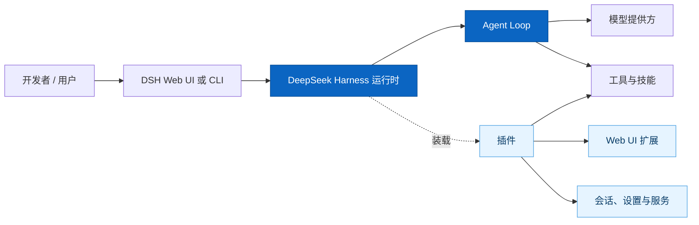
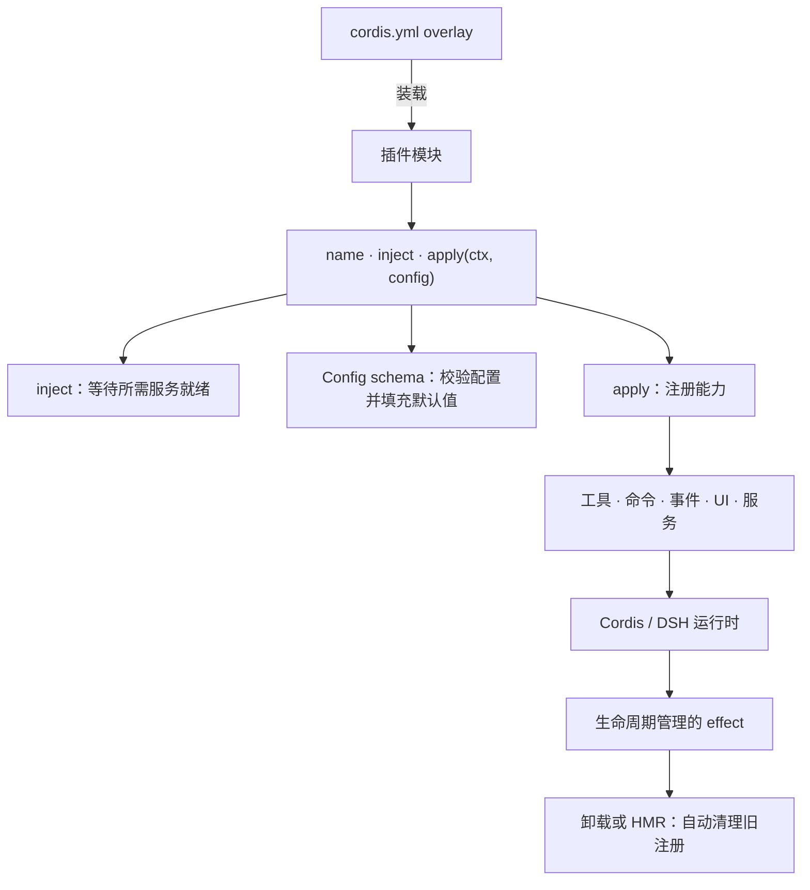
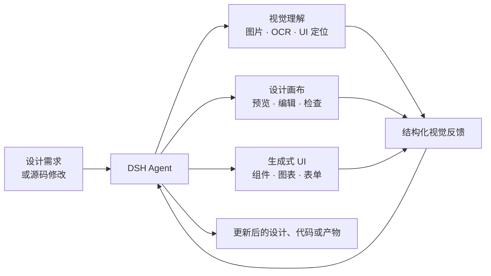
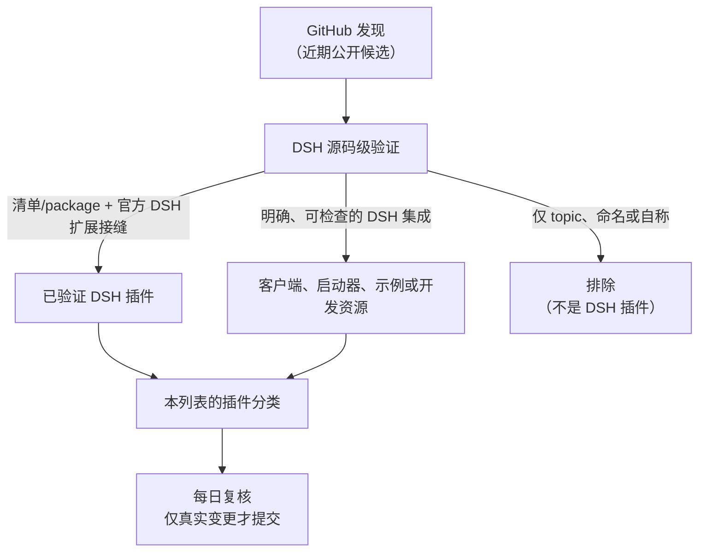
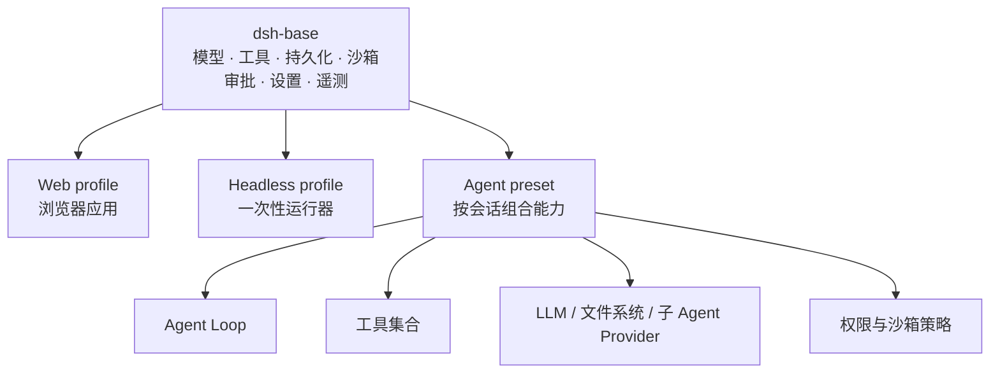
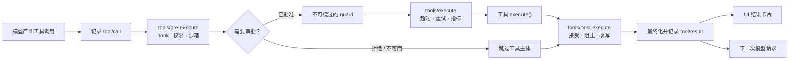
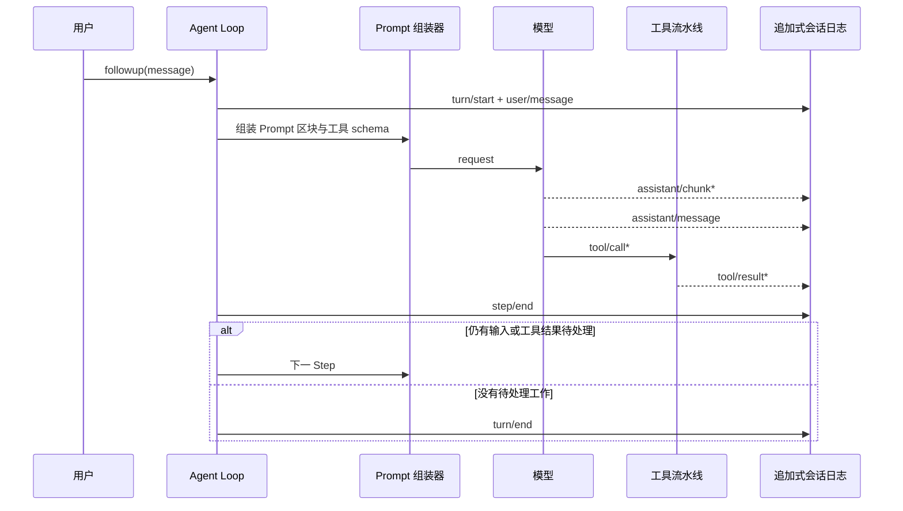
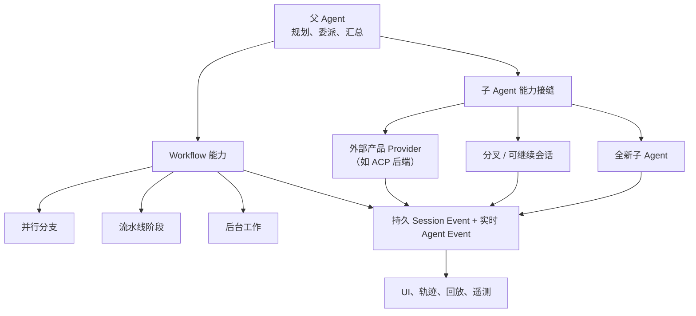

# Awesome DeepSeek Harness Plugins [](https://awesome.re)

[English](README.md) | 简体中文

> 面向 [DeepSeek Harness（DSH）](https://github.com/deepseek-ai/deepseek-harness) 的插件、插件起步项目、工具与一手资料精选索引。

DeepSeek Harness 是 DeepSeek AI 开源的插件优先 Agent Harness：模型、工具、技能、会话、沙箱、文件系统、循环、编排和界面都可以作为插件组合。完整英文目录见 [README.md](README.md)；两个入口维护同一套严格收录标准。

> **开发者预览版**：DSH 迭代很快，可能出现破坏性变更。本仓库是独立社区整理，不代表 DeepSeek AI 或 walkinglabs 的背书。安装第三方插件前请审查源码，并固定 DSH 版本或 commit。



## 快速教程：安装 DSH 并写出第一个插件

### 1. 安装并运行 DeepSeek Harness

先安装当前版本的 [Node.js](https://nodejs.org/)，然后执行：

```sh
npx @deepseek-ai/dsh web
```

打开 `http://127.0.0.1:3080`。在 **Settings → Models** 中填写 DeepSeek API Key；再选择一个工作区，即可开始会话。更多步骤见官方 [Web UI 使用指南](https://github.com/deepseek-ai/deepseek-harness/blob/master/docs/user/guide/index.md)。

### 2. 从源码创建最小插件

当前官方插件开发流程需要先获得 DSH 源码：

```sh
git clone https://github.com/deepseek-ai/deepseek-harness.git
cd deepseek-harness
pnpm install
pnpm run build
mkdir -p scratch-plugin/src
```

创建 `scratch-plugin/src/hello-plugin.ts`：

```ts
import type { Context } from '@deepseek-ai/cordis'

export const name = 'hello-plugin'

export function apply(ctx: Context) {
  console.log('[hello-plugin] loaded')
}
```

再创建 `scratch-plugin/cordis.yml`。把下方路径替换成在 DSH 源码目录执行 `pwd` 后得到的绝对路径：

```yaml
- insert:
    - id: hello
      name: '/absolute/path/to/deepseek-harness/scratch-plugin/src/hello-plugin.ts'
```

使用这个 overlay 启动：

```sh
pnpm dsh web --patch ./scratch-plugin/cordis.yml
```

DSH 启动后，终端应显示 `[hello-plugin] loaded`。这就是最小的 DSH 插件：导出 `apply(ctx)`，并通过 Cordis 上下文注册能力。若要添加 Agent 可调用的工具，请声明 `export const inject = ['tools']`，再通过官方 DSH 工具 API 注册。完整且随版本更新的写法请查看官方[第一个插件教程](https://github.com/deepseek-ai/deepseek-harness/blob/master/docs/user/develop/basic/index.md)和 [Tool 插件教程](https://github.com/deepseek-ai/deepseek-harness/blob/master/docs/user/develop/basic/tool.md)。

### 3. 插件机制如何工作



DSH 基于 **Cordis**，后者是一个运行时组合框架。插件不只是一个 npm 依赖包，而是 DSH 会装载到运行中上下文的模块。它声明 `name`，可选声明 `inject` 依赖（例如 `['tools']`），并导出 `apply(ctx, config)`。Cordis 会等待 `inject` 所需服务准备完成，校验导出的 `Config` schema 并填充默认值，然后调用 `apply`。

在 `apply` 内，插件可以注册供 Agent 调用的工具、供人使用的命令、设置 schema、事件监听器、Web UI 组件，或提供给其他插件的服务。这些注册是由生命周期管理的 effect：配置修改触发热替换，或插件卸载时，Cordis 会自动移除旧注册。只有当插件自行持有需要显式释放的资源（如定时器、网络连接）时，才使用 `ctx.effect()` 返回清理函数。详见官方[配置指南](https://github.com/deepseek-ai/deepseek-harness/blob/master/docs/user/develop/basic/config.md)、[服务指南](https://github.com/deepseek-ai/deepseek-harness/blob/master/docs/user/develop/framework/service.md)及[能力接缝说明](https://github.com/deepseek-ai/deepseek-harness/blob/master/docs/capability-seams.md)。

### 4. 设计与创意工具 / Design & Creative Tools

DSH 的设计类插件可将 Agent 的规划和工具调用连接到视觉理解、设计画布、界面生成与图像工作流。与其他条目一样，安装前请审查源码和所需权限。



- [dsh-openpencil](https://github.com/ZSeven-W/dsh-openpencil) - 多帧预览、交互式画布与受管理编辑器工作台。 / Multi-frame previews, an interactive canvas, and managed editor workbenches.
- [dsh-genui](https://github.com/omdsh-dev/dsh-genui) - 在回复中渲染交互组件、图表、表单、Mermaid 与 3D 场景，并回传操作事件。 / Inline generated UI with an action loop.
- [dsh-web-review](https://github.com/CanglongCl/dsh-web-review) - 网页预览与元素批注反馈，帮助 Agent 改源码。 / Web preview and annotated visual feedback for source editing.
- [dsh-vision-toolkit](https://github.com/Anionex/dsh-vision-toolkit) - 图片问答、OCR、UI 还原、定位、像素差分与视觉产物。 / Image Q&A, OCR, UI restoration, grounding, and pixel diffs.
- [dsh-ernie-image](https://github.com/omdsh-dev/dsh-ernie-image) - 以 DSH bundle patch 打包的图像生成集成。 / Image-generation integration packaged for DSH.
- [dsh-visualize](https://github.com/Nagi-ovo/dsh-visualize) - 在受限 CSP 的沙箱 iframe 中渲染行内交互 HTML 卡片，并导出到工作区。 / Inline interactive HTML cards in a sandboxed iframe with constrained CSP and workspace export.
- [dsh-image-to-path](https://github.com/cesaryike/dsh-image-to-path) - 仅同源、具备大小与图片魔数校验的粘贴/拖放上传，保存到当前会话工作区。 / Same-origin image paste/drop uploads with size and magic-byte checks, saved in the active session workspace.
- [dsh-image-gen](https://github.com/shanliuling/dsh-image-gen) - 使用 Google、OpenAI 兼容接口、Seedream、DashScope 或本地 ComfyUI 生成和编辑图片；凭据保存在 DSH 只写凭据服务中。 / Generate and edit images with Google, OpenAI-compatible, Seedream, DashScope, or local ComfyUI providers; credentials stay in DSH's write-only credential service.

### 5. 这个 Awesome 仓库收录什么



本仓库会区分“已验证 DSH 插件”与启动器、客户端、生态目录等“有用但非插件”的资源。新增条目需要的证据详见[完整收录规范](docs/INCLUSION_POLICY.md)。

### 5. 同一运行时，不同插件组合

DSH 的 profile 是插件组合，而不是分别维护的多套产品。官方基础 bundle 包含模型适配器、工具、持久化、沙箱与审批策略、设置、凭据和遥测；Web 与 headless bundle 在此基础上增加不同的入口界面；Agent preset 还能为单个会话选择不同的能力集合。



因此，“模式”主要是某一套插件图与策略集的选择，而不是另一套独立产品。这不保证每种组合都稳定或适合每项任务；DSH 仍处于开发者预览阶段。

### 6. 工具调用走同一条受控执行流水线



插件可以在官方规定的阶段插入策略、可观测性、超时或结果处理，而无需修改 Agent Loop。官方流水线也让 Code Mode 分派的子调用通过同一条路径，从而保留审批、沙箱和日志边界。

### 7. Agent 的 Turn、Step 与追加式会话日志



会话日志是模型上下文的事实来源：它持久记录 turn、消息、工具调用/结果和原始流式 chunk。分叉、恢复、回放、转录、遥测与持久化都从该事件流派生；任何模型可见内容都必须能从中重建。

### 8. 多 Agent 与 Workflow 扩展接缝



DSH 提供了以层级委派为主的表面与 workflow 组件；子 Agent 接缝后的 provider 可以替换。其架构关键在于可替换性和共享可观测性，而不是声称创造了全新的多 Agent 范式。

## 快速开始：官方 DSH 资料

- [DeepSeek Harness 官方源码](https://github.com/deepseek-ai/deepseek-harness) - 版本、issue 与兼容性的唯一首要依据。
- [官方文档指南](https://deepseek-harness.github.io/deepseek-harness/guide) - DSH 官方文档入口。
- [运行 DSH](https://github.com/deepseek-ai/deepseek-harness#run) - 通过 `npx @deepseek-ai/dsh web` 启动本地 Web UI。
- [架构](https://github.com/deepseek-ai/deepseek-harness/blob/master/docs/architecture.md) - 了解插件优先运行时的结构。
- [能力接缝](https://github.com/deepseek-ai/deepseek-harness/blob/master/docs/capability-seams.md) - 官方定义的扩展边界。
- [Cordis 入门](https://github.com/deepseek-ai/deepseek-harness/blob/master/docs/cordis-primer.md) - DSH 所依赖的可组合框架。
- [开发指南](https://github.com/deepseek-ai/deepseek-harness/blob/master/docs/development.md) - 从源码构建及贡献官方项目。
- [防御性模式](https://github.com/deepseek-ai/deepseek-harness/blob/master/docs/defensive-patterns.md) - 更安全地扩展 DSH 的官方建议。
- [测试](https://github.com/deepseek-ai/deepseek-harness/blob/master/docs/testing.md) - 官方测试方式。
- [官方示例](https://github.com/deepseek-ai/deepseek-harness/tree/master/examples) - Headless、JSON-RPC、MCP Memory、定时 Web、Cordis 示例。

## 如何找插件

- [GitHub `dsh-plugin` topic](https://github.com/topics/dsh-plugin) - 官方建议用于 DSH 插件发现的 topic；**仅用于发现，不构成收录证据**。
- [插件注册表](https://github.com/vlln/plugin-registry) - Repository-plugin 控制台和 `make-dsh-plugin` 开发指导。
- [插件工作坊](https://github.com/omdsh-dev/dsh-hub-workshop) - 社区插件市场和注册表实践。

## 收录保证

我们不因为名称、topic 或 README 自称 DSH 插件就收录。每个新插件都必须通过[源码级收录规范](docs/INCLUSION_POLICY.md)：存在真实 DSH 清单/插件包，或能在官方 DSH 扩展接缝中验证的实现。每日只检索过去 48 小时的新/更新项目，并对脚本、依赖、入口、工作流及敏感操作做静态安全初筛；只有两项都通过才会收录。没有合格候选就不修改仓库。这不是完整安全审计或兼容性保证。

## 完整目录 / Full index

[英文完整目录](README.md) 按下列分类维护项目的英文说明；每一类均只收录符合上述 DSH 规则的项目：

- 生产力与 Agent 工作流 / Productivity & Agent Workflow
- 上下文、记忆与可观测性 / Context, Memory & Observability
- 工具、集成与自动化 / Tools, Integrations & Automation
- 设计与创意工具 / Design & Creative Tools
- 浏览器、计算机操作与远程执行 / Browser, Computer Use & Remote Execution
- 终端与 Web 界面 / Interfaces & Web UI
- 开发工具 / Developer Tooling
- 实用工具 / Utilities
- 创意与个性化 / Creative & Personal
- 游戏与游玩 / Games & Play
- 启动器与客户端（不是插件）/ Launchers & Clients (not plugins)
- 生态目录（不是插件）/ Ecosystem Indexes (not plugins)

### 游戏与游玩 / Games & Play

- [dsh-minigames](https://github.com/lhh010/dsh-minigames) - DSH Web 右侧离线小游戏面板，包含恐龙跳一跳、俄罗斯方块、坦克大战、五子棋、扫雷等 18 款游戏。 / An offline DSH Web side panel with 18 mini-games, including Dino, Tetris, Tanks, Gomoku, and Minesweeper.

### 近期通过核验的新增 / Recently verified additions

- [Busabase](https://github.com/busabase/busabase-dsh-plugin) - 可检索的知识与结构化记录，支持人工审核拟议写入、MCP 工具及 Web UI 卡片；`@busabase/dsh-plugin` 0.1.6 声明 DSH 0.1.1-rc.2 peer 依赖。 / Searchable knowledge and structured records with human-reviewed proposed writes, MCP tools, and Web UI cards; `@busabase/dsh-plugin` 0.1.6 declares DSH 0.1.1-rc.2 peer dependencies.

- [dsh-crew](https://github.com/ZSeven-W/dsh-crew) - 从 Claude Code 或 Codex 调度 DSH Worker，提供宿主内会话、实时进度、工作区锁与递归防护；外部 CLI Worker 需显式选择，且会使用其文档所述的始终批准模式。 / Dispatch DSH workers from Claude Code or Codex with in-host sessions, live progress, workspace locks, and recursion guards; external CLI workers are an explicit opt-in and use their documented always-approve modes.

- [dsh-schematic](https://github.com/Mason-1011/dsh-schematic) - 实时插件拓扑与活动查看器，带受保护的组合工作台：编辑先预览、校验、备份，且可回滚；已使用 DSH 0.1.0-rc.8 测试。 / Live plugin-topology and activity viewer with a guarded composition workbench: edits are previewed, validated, backed up, and reversible; tested with DSH 0.1.0-rc.8.

- [dsh-product-subagent-console](https://github.com/Jokasa7/dsh-product-subagent-console) - 面向 DSH 对话的多 Agent 工作台：支持可编辑任务方案、真实子会话观测、计划与实际运行对照，以及基于证据的恢复预览；已使用 DSH 0.1.1-rc.2 测试。 / Conversation-level multi-agent workbench for editable task planning, real child-session observation, plan-versus-runtime comparison, and evidence-backed recovery previews; tested with DSH 0.1.1-rc.2.

- [dsh-tmux-cc](https://github.com/adrianleb/dsh-tmux-cc) - 为 DSH Web 提供持久的 tmux 控制模式驾驶舱，在停靠栏中镜像原生窗格。 / Persistent tmux control-mode cockpit for DSH Web that mirrors native panes in a dock.
- [dsh-mobile](https://github.com/saya-ch/dsh-mobile) - 为 Android App 和手机浏览器提供经过配对认证的 DSH HTTPS 访问，包含独立移动布局、相互分离的局域网与可选 Funnel/cpolar 远程通道；已验证兼容 DSH 0.1.1-rc.2。 / Paired HTTPS access to the native DSH Web profile from Android or mobile browsers, with a dedicated mobile layout, separate LAN and optional Funnel/cpolar routes; verified with DSH 0.1.1-rc.2.
- [dsh-llm-verifier](https://github.com/Web0926/dsh-llm-verifier) - 经审批的 3/5 路编码 Agent 优选编排：隔离 Git worktree、宿主验证命令、LLM 验证器与独立赢家应用步骤，并包含凭据和进程输出防护。 / Approval-gated best-of-3/5 coding-agent orchestration with isolated Git worktrees, host validation commands, an LLM verifier, and a separate winner-apply step with credential and process-output safeguards.
- [DeepSeek Harness Brain](https://github.com/AgriciDaniel/deepseek-harness-brain) - 带来源引用的学习与开发资源，含白话指南、Obsidian 知识库、辅助 Skill 与可移植性指引；基于固定 DSH 上游提交审阅。 / Source-cited learning and development resource with a plain-English guide, Obsidian knowledge base, assistant skill, and portability guidance; reviewed against a pinned upstream DSH commit.
- [dsh-smooth-stream](https://github.com/Laplace-bit/dsh-smooth-stream) - 为 DeepSeek Harness Web UI 提供流畅流式渲染和丝滑滚动；已使用 DSH 0.1.0-rc.6 测试。 / Fluid streaming rendering and smooth scrolling for the DeepSeek Harness Web UI; tested with DSH 0.1.0-rc.6.
- [odai-dsh-plugin](https://github.com/orziz/odai/tree/main/dsh/plugin) - 面向整个 DSH profile 的治理与路由 bundle，提供用于职责与证据检查的 Web Control Center，以及压缩、本地作用域语义记忆、安全连续性与真实验收；兼容 DSH 0.1.5-rc.1。 / Profile-wide DSH governance and routing with a Web Control Center for responsibility and evidence inspection, plus compaction, scoped semantic memory, safety continuity, and verified delivery; compatible with DSH 0.1.5-rc.1.
- [dsh-mqtt](https://github.com/UllrAI/dsh-mqtt) - 通过 MQTT 提交、引导、观察和取消 DSH 会话的协议驱动与 Agent Worker 网关；已使用 DSH `0.1.0-rc.7` 测试。 / MQTT protocol driver and agent worker gateway for submitting, steering, observing, and cancelling DSH sessions; tested with DSH `0.1.0-rc.7`.
- [dsh-file-claim](https://github.com/Nwflower/dsh-file-claim) - 为同一工作区的并行 DSH 会话提供文件认领/释放保护，含过期心跳接管与待处理三路合并区。 / File claim/release protection for parallel DSH sessions in one workspace, with stale-heartbeat takeover and a pending three-way-merge area.
- [dsh-context-proxy](https://github.com/EvilIrving/dsh-context-proxy) - 基于官方 session-query 与 subprocess 接缝，按需通过 `context_query`、`context_slice`、`context_grep` 读取已持久化会话历史。 / On-demand context tools over persisted session history, using the official session-query and subprocess seams.
- [dsh-fail-logger](https://github.com/Areium/dsh-fail-logger) - 将原生、Code Mode 与内嵌工具调用失败按错因去重写入本地维护的 Skill 区段；落盘前会脱敏已支持的秘密模式。 / Deduplicates failed tool calls into a locally maintained skill section; supported secret patterns are redacted before persistence.
- [dsh-figma-to-lottie](https://github.com/zimai233/dsh-figma-to-lottie) - 将 SVG 路径与关键帧数据编译为自包含的 Lottie JSON 动画文件。 / Compile SVG paths and keyframe data into self-contained Lottie JSON animation files.
- [dsh-reviewer-bot](https://github.com/chaojixinren/dsh-reviewer-bot) - 面向 GitHub 与 GitLab 的可配置 DSH 原生代码评审 bundle，写操作默认拒绝，并支持本地回放。 / Configurable DSH-native code-review bundle for GitHub and GitLab, with fail-closed write mode and local replay support.
- [dsh-reasoning-effort](https://github.com/HanaAyane/dsh-reasoning-effort) - 遵循模型适配器实际声明档位的 Codex 风格会话模型与思考强度选择器，并为自定义 provider 提供只读声明指引。 / Codex-style session model and reasoning-effort selector that follows adapter-advertised levels, with read-only guidance for custom-provider declarations.
- [dsh-auto-mode](https://github.com/NanmiCoder/dsh-auto-mode) - 默认拒绝的自动权限策略，含受保护路径与凭据检查；歧义工具调用会使用脱敏后的分类器兜底。 / Fail-closed automatic-permission policy with protected-path and credential checks, plus a redacted classifier fallback for ambiguous tool calls.
- [dsh-toy](https://github.com/c3ll256/dsh-toy) - 通过 Intiface 或 MonsterParty 控制兼容个人设备；可选 Intiface 助手会在缺失时下载固定版本、经 SHA-256 校验的上游引擎。 / Control compatible personal devices through Intiface or MonsterParty; the optional helper downloads a pinned, SHA-256-verified upstream engine when absent.
- [Tabbit Browser for DSH](https://github.com/Tabbit-Browser/dsh-tabbit) - 浏览器自动化 Skill，支持通过显式工具在所需浏览器缺失或过期时下载对应地区的 Tabbit Browser 安装器。 / Browser-automation skill with an explicit tool that can download the region-appropriate Tabbit Browser installer when the supported browser is absent or outdated.
- [Code2Skill](https://github.com/leechen298/Code2Skill) - 从已授权源码生成并复核 Function、MCP 与 Agent Skill 包的 3 个 DSH Skills bundle（固定版本 v1.1.3）。 / A three-skill DSH bundle for generating and reviewing Function, MCP, and Agent Skill packages from authorized source code (version-pinned at v1.1.3).
- [dsh-passwords](https://github.com/slywalker2006/dsh-passwords) - 面向远程、多用户 DSH Web 的登录网关，提供 HTTPS、配额、沙箱限制与审计日志。 / Login gateway for remote, multi-user DSH Web access, with HTTPS, quotas, sandbox restrictions, and audit logs.
- [dsh-compaction-instant](https://github.com/KitDoesIt/dsh-compaction-instant) - 离线、确定性的 DSH 基础上下文压缩替代实现，并提供 append-only 会话日志的回溯工具。 / Offline deterministic replacement for the DSH basic compaction seam, with append-only-log recall tools.
- [dsh-cost-meter](https://github.com/Han-1413141/dsh-cost-meter) - 会话与当日 API 费用、预算与官方余额统计（DSH Web），带历史看板与官方价格一键同步（峰谷计价）。 / Per-session and daily API cost, budget, and official-balance tracking for the DSH Web UI, with a history dashboard and one-click official price sync (peak/off-peak pricing).
- [dsh-web-billing](https://github.com/bpc-oss/dsh-web-billing) - DeepSeek Harness 人民币/美元计费插件：官方政策自动计价（含峰谷）、按 Provider 计费（按量/订阅/白嫖/本地）、来源分组费用页、时间段筛选、预算、余额、CSV/JSON 导出。
- [dsh-visualize](https://github.com/Nagi-ovo/dsh-visualize) - 受限 CSP 的沙箱可视化卡片。 / Sandboxed visualization cards with a constrained CSP.
- [dsh-image-to-path](https://github.com/cesaryike/dsh-image-to-path) - 带同源、大小与图片类型检查的工作区图片上传。 / Workspace image upload with same-origin, size, and image-type checks.
- [dsh-ux-simple](https://github.com/KhalilYamber/dsh-prism) - 保留原生界面的同时，提供两档工具调用卡片与白话说明。 / Two-mode tool-call cards with plain-language explanations while preserving the native view.
- [dsh-any-background](https://github.com/Tkingxiao/dsh-any-background) - 在本地浏览器保存主题色、壁纸、透明度与模糊度设置。 / Local-browser theme color, wallpaper, opacity, and blur customization.
- [dsh-telemetry-redactor](https://github.com/030611/dsh-telemetry-redactor) - 对导出的 `session-telemetry/record` 副本脱敏已支持的秘密模式，不改写权威会话日志；以 DSH 提交 `47f943859bef60e4160492346772ded9b24f765a` 为审计基线，并用 `dsh-session-telemetry` rc.6 实测。 / Redacts supported secret patterns from exported telemetry copies without changing the canonical session log; audited against DSH commit `47f943859bef60e4160492346772ded9b24f765a` and tested with `dsh-session-telemetry` rc.6.
- [dsh-verification-receipt](https://github.com/030611/dsh-verification-receipt) - 将每轮工具结果与启发式验证信号摘要写入本地 JSONL，不保存提示词、工具参数或结果正文；以 DSH 提交 `47f943859bef60e4160492346772ded9b24f765a` 为审计基线，并用 `dsh-session` rc.6 实测。 / Writes local JSONL summaries of per-turn tool outcomes and heuristic verification signals without storing prompts, tool arguments, or result text; audited against DSH commit `47f943859bef60e4160492346772ded9b24f765a` and tested with `dsh-session` rc.6.
- [dhicoc/dsh-reverse-skill](https://github.com/dhicoc/dsh-reverse-skill) - 完整 reverse-skill（85 个 SKILL.md）的 DSH 技能路由包，覆盖逆向工程、授权渗透测试与安全研究。 / An 85-skill DSH router pack for reverse engineering, authorized penetration testing, and security research.
- [dsh-context](https://github.com/bowenliang123/dsh-context) - 上下文洞察面板：一眼看清模型上下文窗口的组成与变化——构成对照窗口大小、按请求历史趋势、压缩/注入事件、消息级 token 统计。 / Context insight panel: see what the model's context window is made of and how it evolves — composition vs. window size, per-request history, compression/injection events, and per-message token stats.
- [dsh-bell-notify](https://github.com/Laplace-bit/dsh-bell-notify) - 生命周期铃声 + 状态点：为每个环节（启动、工具调用、命令、等待审批、回合完成、空闲）播放专属提示音，Web Audio 实时合成零音频文件，可上传自定义音；经 `dsh.bundle` manifest 与 Cordis patch 声明安装。 / Per-lifecycle-event chimes for DSH, synthesized live with Web Audio (zero audio files), plus a breathing status dot; declarable via a `dsh.bundle` manifest with a Cordis patch.
- [dsh-reach](https://github.com/PerryLink/dsh-reach) - 多渠道审批/提问桥：把 DSH 审批卡与提问卡推送到 IM 渠道（微信、Telegram、飞书）并在聊天中作答，带逐渠道安全、会话控制台与开放推送服务；经 `dsh.bundle` manifest 安装（npm `dsh-reach`）。 / Multi-channel approval and question bridge: pushes DSH approval and question cards to IM channels (WeChat, Telegram, Feishu) and answers them from chat; installs via the `dsh.bundle` manifest (npm `dsh-reach`).
- [dsh-ticktick](https://github.com/PerryLink/dsh-ticktick) - TickTick（滴答清单）任务桥：会话头部任务面板（列表筛选、快速添加、完成、删除、截止日期、拖拽排序）+ 11 个精选 agent 工具，全部走官方 TickTick MCP 端点；经 `dsh.bundle` manifest 安装（npm `@perrylink/dsh-ticktick`）。 / TickTick/Dida365 task bridge: a session-header task panel plus eleven curated agent tools over the official TickTick MCP endpoint; installs via the `dsh.bundle` manifest (npm `@perrylink/dsh-ticktick`).
- [dsh-team-rooms](https://github.com/PerryLink/dsh-team-rooms) - 持久化、跨会话的多 Agent 团队房间：成员、消息总线、共享任务板、审批门控交接与跨重启存活的时间线；经 `dsh.bundle` manifest 安装（npm `dsh-team-rooms`）。 / Persistent cross-session multi-agent team rooms with a message bus, a shared task board, approval-gated handoffs, and a timeline that survives restarts; installs via the `dsh.bundle` manifest (npm `dsh-team-rooms`).
- [dsh-autotier](https://github.com/PerryLink/dsh-autotier) - 强/廉模型档位自动路由：意图门控落档、plan 模式交接、确定性高风险护栏与 TTL 升级回退；经 `dsh.bundle` manifest 安装（npm `dsh-autotier`）。 / Automatic strong/cheap model-tier routing with intent-gated tier landing, plan-mode handoff, deterministic guards, and TTL escalation fallback; installs via the `dsh.bundle` manifest (npm `dsh-autotier`).
- [dsh-plugin-guide](https://github.com/PerryLink/dsh-plugin-guide) - 插件开发知识库（按需 agent 技能）+ `dsh-plugin-dev` CLI 工具链；经 `dsh.bundle` manifest 安装（npm `dsh-plugin-guide`），维护于 dsh-v0.1.5-rc.2 宿主线。 / Plugin-development knowledge base as an on-demand agent skill plus the `dsh-plugin-dev` CLI toolchain; installs via the `dsh.bundle` manifest (npm `dsh-plugin-guide`).
- [dsh-cert-mcp](https://github.com/PerryLink/dsh-cert-mcp) - 用于查询公开插件认证等级、快照和证据的只读 DSH 工具 bundle 与 MCP server；经 `dsh.bundle` manifest 安装（npm `dsh-cert-mcp`）。 / Read-only DSH tool bundle and MCP server for looking up public plugin-certification grades, snapshots, and supporting evidence; installs via the `dsh.bundle` manifest (npm `dsh-cert-mcp`).
- [jev-dsh-decision](https://github.com/Devin-AXIS/jev-dsh-decision) - 注册 DSH 工具和技能的决策引擎 bundle；配置用户自己的 `TYPESAFE_API_KEY` 后，会将最小任务状态发送到其文档所述的 TypeSafe API 以取得结构化决策结果。 / Decision-engine bundle that registers DSH tools and skills; with a user-configured `TYPESAFE_API_KEY`, minimal task state is sent to the documented TypeSafe API for structured decision results.
- [dsh-jev](https://github.com/buberlo/dsh-jev) - 对接 DSH pre-step、工具评估、观测、技能和模型路由接缝的决策层；默认本地 mock/shadow，显式启用 live 模式才会把脱敏任务状态发给 TypeSafe，并可要求审批或拒绝调用。 / Decision layer for DSH’s pre-step, tool-assessment, observation, skill, and model-routing seams; defaults to local mock/shadow behavior, while explicit live mode sends redacted task state to TypeSafe and can request approval or withhold a call.
- [Deepseek-harness-MELOS](https://github.com/kahana1247zero-web/Deepseek-harness-MELOS) - 施工→复核的接力工作流，提供 DSH 工具、Agent ring 和宿主面板，并以本地子进程调用随包 Python core。 / Builder-to-reviewer relay workflow with DSH tools, agent rings, and a host panel; invokes its bundled Python core as a local child process.
- [dsh-connect-qoder](https://github.com/hdhgsysh/dsh-connect-qoder) - 在 DSH 中注册 Qoder 中国区和全球模型 Provider；支持的本地 Qoder 桌面端会读取当前用户加密登录态，并且只将 Provider 请求发往 Qoder 文档所列区域端点。 / Registers Qoder CN and global model providers in DSH. On supported local Qoder desktop installations it reads the current user’s encrypted sign-in state and sends provider requests only to Qoder’s documented regional endpoints.
- [echocat-skill-panel-3.0](https://github.com/VDERR/dsh-echocat-skill-panel) - 每轮 Skill 使用审计和应用内管理器；经认证、显式开启的面板可分阶段写入并带备份地安装、更新、改名和卸载 Skills，版本检查只在用户触发时访问 npm 和 GitHub。 / Per-turn DSH skill-use audit and in-app manager. Its authenticated, opt-in panel can install, update, rename, and uninstall skills with staged writes and backups; optional release checks contact npm and GitHub only on user action.
- [dsh-plugin-upgrade-015](https://github.com/PerryLink/dsh-plugin-upgrade-015) - 合并后的锁版本升级走廊（0.1.3-alpha.1 → 0.1.5-rc.1 两条封闭迁移腿）：带证据的版本卡 + 零依赖 20 接缝扫描器；经 `dsh.bundle` manifest 安装（npm `dsh-plugin-upgrade-015`），另有 npx 扫描 CLI。 / Merged version-locked upgrade corridor with an evidence-bound version card plus a 20-seam scanner; installs via the `dsh.bundle` manifest (npm `dsh-plugin-upgrade-015`).
- [dsh-test-drive](https://github.com/PerryLink/dsh-test-drive) - 一次性 DSH_HOME 中的隔离「安装→冒烟→卸载」实测，输出结构化 dsh-test-drive/v1 结果矩阵；经 `dsh.bundle` manifest 安装（npm `dsh-test-drive`）。 / Isolated install-smoke-uninstall test drives for DSH plugins in a throwaway DSH_HOME, emitting structured dsh-test-drive/v1 pass/fail matrices; installs via the `dsh.bundle` manifest (npm `dsh-test-drive`).
- [dsh-auto-review](https://github.com/PerryLink/dsh-auto-review) - 审批应答链上的第二模型自动复审：只读复审子代理返回带理由的结构化 allow/deny 判定，默认失败即拒绝。声明兼容 DSH 0.1.6-alpha.2。
- [dsh-background-agents](https://github.com/PerryLink/dsh-background-agents) - 基于官方子代理接缝的持久化后台子代理：可从任意会话启动，在 Web UI 侧边栏查看进度，随时发送消息和中断，并支持按子代理限定工具范围、人格与委派深度上限。声明兼容 DSH 0.1.6-alpha.2。
- [dsh-budget](https://github.com/PerryLink/dsh-budget) - llm/stream 瀑布上的按插件用量预算与成本上限：按模型的用量核算、带警告/阻断切换的会话与月度预算、延迟窗口，以及碳足迹估算。声明兼容 DSH 0.1.6-alpha.2。
- [dsh-checkpoint-rewind](https://github.com/PerryLink/dsh-checkpoint-rewind) - DeepSeek Harness 的 Claude Code /rewind：在每次变更类工具执行前进行 git 优先的工作区快照，以轮次边界派生会话，并提供一次性的 /rewind 命令，可恢复文件并把会话回退派生到某个检查点。声明兼容 DSH 0.1.6-alpha.2。
- [dsh-claude-move](https://github.com/PerryLink/dsh-claude-move) - 四来源迁移向导：将 Claude Code、Codex、OpenCode 和 Hermes 的会话、记忆、技能、指令与斜杠命令迁移到 DSH（/move 向导，带审批门禁和幂等的 move.json，会话可恢复）。声明兼容 DSH 0.1.6-alpha.2。
- [dsh-click](https://github.com/PerryLink/dsh-click) - Windows 桌面 computer-use 工具（点击、输入、按键、截图），具备新鲜度检查、审批门控、围绕每个动作的进程身份校验，以及脱敏的审计轨迹。声明兼容 DSH 0.1.6-alpha.2。
- [dsh-composer-history](https://github.com/PerryLink/dsh-composer-history) - Web 输入框的终端风格输入历史：以边缘优先的方向键回溯，可精确恢复草稿/光标位置，浏览器本地持久化历史，Ctrl+R 反向搜索，以及滑动上下文感知；0.5.0 新增智能输入层——跨会话片段（/save、/load）、带变量的提示词模板、复用洞察和压缩摘要高亮。声明兼容 DSH 0.1.6-alpha.2。
- [dsh-data-quality](https://github.com/PerryLink/dsh-data-quality) - DeepSeek Harness 的数据质量检查——剖析、清洗和校验流水线，并生成结构化报告。声明兼容 DSH 0.1.6-alpha.2。
- [dsh-defend](https://github.com/PerryLink/dsh-defend) - 在 agent/pre-step、tools/pre-execute 和 tools/post-execute 接缝上检测提示注入、越狱和密钥泄露模式，具备 allow/ask/block 分级、脱敏的 defend/detection 审计事件、defend_report 工具，以及破坏性删除命令防护。声明兼容 DSH 0.1.6-alpha.2。
- [dsh-doublecheck](https://github.com/PerryLink/dsh-doublecheck) - 工程纪律守卫：首次编辑前进行需求质询、红/绿测试证据门禁、派生对手审查，以及带按维度验证工作流的交付报告。声明兼容 DSH 0.1.6-alpha.2。
- [dsh-draw](https://github.com/PerryLink/dsh-draw) - 多引擎文生图（OpenAI Images 和智谱 CogView 预设），支持按会话配额跟踪、引擎故障转移、凭据安全配置，以及带重新生成的结果卡片。声明兼容 DSH 0.1.6-alpha.2。
- [dsh-fast](https://github.com/PerryLink/dsh-fast) - DeepSeek Harness 的性能剖析与 LLM 缓存诊断——上下文工程、延迟剖析和缓存行为报告。声明兼容 DSH 0.1.6-alpha.2。
- [dsh-fund-research](https://github.com/PerryLink/dsh-fund-research) - 面向中国公募基金的确定性研究报告，基于公开来源数据（天天基金和东方财富）构建，采用纯函数指标（业绩分解、持仓穿透、风格归因、经理画像），并提供带逐项数字快照可追溯附录的版本化报告。声明兼容 DSH 0.1.6-alpha.2。
- [dsh-github](https://github.com/PerryLink/dsh-github) - 官方级 GitHub CI 集成：复合 action.yml、带幂等行内评论和状态检查门禁的轮询式 PR 审查机器人，以及所有写入都由人工审批门控的 PR/issue 工具。声明兼容 DSH 0.1.6-alpha.2。
- [dsh-industry-research](https://github.com/PerryLink/dsh-industry-research) - DeepSeek Harness 的确定性行业研究报告——公司与行业研究流程基于分阶段证据生成结构化、可验证的报告。声明兼容 DSH 0.1.6-alpha.2。
- [dsh-library](https://github.com/PerryLink/dsh-library) - 将本地 markdown 与文本文档转化为可查询的知识库，支持语义与关键词混合检索、引用校验和来源注入。声明兼容 DSH 0.1.6-alpha.2。
- [dsh-local-ai](https://github.com/PerryLink/dsh-local-ai) - DeepSeek Harness 的 Ollama 提供方，支持模型管理、健康检查、基于规则的本地路由和云端回退。声明兼容 DSH 0.1.6-alpha.2。
- [dsh-lsp-actions](https://github.com/PerryLink/dsh-lsp-actions) - DSH 的 LSP 动作面：诊断、格式化、补全、代码操作、符号、签名帮助、内联提示和重命名，全部由真实语言服务器支撑。声明兼容 DSH 0.1.6-alpha.2。
- [dsh-mask](https://github.com/PerryLink/dsh-mask) - DeepSeek Harness 的 PII 脱敏——在请求前匿名化姓名、电话、邮箱、ID 和密钥，并在展示层还原，使明文不进入会话日志。声明兼容 DSH 0.1.6-alpha.2。
- [dsh-mcp-panel](https://github.com/PerryLink/dsh-mcp-panel) - 官方 DSH MCP 客户端的只读运行时管理面板：通过 /mcp 命令和设置标签页查看连接状态、已注册工具、错误和重连次数，具备脱敏显示以及启用/禁用补丁建议。声明兼容 DSH 0.1.6-alpha.2。
- [dsh-memento](https://github.com/PerryLink/dsh-memento) - 有界、分层、审批门控、可审计的跨会话记忆：带类型的 `ctx.memory` 接缝、零依赖 SQLite 提供方、`memory` 工具和冻结快照注入，外加带适配器注册表与可分发一致性套件的 dsh-memory-protocol v1 演练。声明兼容 DSH 0.1.6-alpha.2。
- [dsh-observe](https://github.com/PerryLink/dsh-observe) - 将会话事件流以脱敏、带缓冲的追踪和指标形式导出到 OpenTelemetry OTLP 和 Langfuse，默认关闭。声明兼容 DSH 0.1.6-alpha.2。
- [dsh-output-styles](https://github.com/PerryLink/dsh-output-styles) - 运行时可切换的模型输出风格，与 Claude Code outputStyles 对齐，并提供 output.render.* 展示协议：/style 命令、按会话持久化、systemPrompt 注入、六种内置风格、Web 选择器，以及带按会话/按工具规则的渲染器注册表和 /export。声明兼容 DSH 0.1.6-alpha.2。
- [dsh-permission-rules](https://github.com/PerryLink/dsh-permission-rules) - Claude Code 风格的声明式权限规则：在 tools/pre-execute 瀑布上按顺序匹配工具名称、参数、工作区路径和代理身份的 allow/deny/ask YAML 规则，并具备完整的会话日志审计、dry-run 模式和热重载。声明兼容 DSH 0.1.6-alpha.2。
- [dsh-plugin-doctor](https://github.com/PerryLink/dsh-plugin-doctor) - 面向 DSH 插件的零依赖静态与沙箱冒烟检测器：包结构门禁、Cordis 契约扫描、无密钥无头冒烟，以及生态列表检查。声明兼容 DSH 0.1.6-alpha.2。
- [dsh-plugin-kit](https://github.com/PerryLink/dsh-plugin-kit) - 用于编写 DeepSeek Harness 插件的共享工具包，以 @perrylink/dsh-plugin-kit 发布：可插拔的提供方注册表接缝、失败即拒绝的审批与会话事件门禁、共享的 sanitize/pricing/judge 模块，以及新插件骨架。声明兼容 DSH 0.1.6-alpha.2。
- [dsh-plugin-upgrade](https://github.com/PerryLink/dsh-plugin-upgrade) - DeepSeek Harness 的插件作者升级技能：单个包携带走廊索引，能检测调用方所处的对等版本区间并路由到与之匹配的封闭走廊卡片（0.1.3-alpha.1 -> 0.1.5-rc.1 为 A+B 段，0.1.5-rc.2 -> 0.1.6-alpha.2 为 C 段），另附以 bundle 技能和 npx CLI 形式分发的零依赖接缝扫描器。声明兼容 DSH 0.1.6-alpha.2。
- [dsh-research-report](https://github.com/PerryLink/dsh-research-report) - DeepSeek Harness 的可验证研究报告引擎，具备内容寻址的证据账本、版本化的密封报告（每条论断都带有验证结论，并由清单哈希封存目录），以及复用 ctx.web 和 ctx.jobs 接缝的检索编排。声明兼容 DSH 0.1.6-alpha.2。
- [dsh-score](https://github.com/PerryLink/dsh-score) - 面向 DeepSeek Harness 插件的多维度质量评分，基于真实 CLI 证据，从安装成功率、维护活跃度、文档完整度、安全扫描和协议合规性等方面对仓库或 npm 包打分，并生成 JSON 或 Markdown 排行榜报告。声明兼容 DSH 0.1.6-alpha.2。
- [dsh-session-pin](https://github.com/PerryLink/dsh-session-pin) - 将会话和工作区置顶到 Web 侧边栏顶部，支持每个置顶项的行颜色、标题栏开关和置顶面板；0.4.0 新增导航组织器——置顶分组（看板）、标签与已保存的筛选视图、会话健康摘要，以及 /goto。声明兼容 DSH 0.1.6-alpha.2。
- [dsh-session-sync](https://github.com/PerryLink/dsh-session-sync) - DeepSeek Harness 的跨设备会话同步——通过 git 在多台机器之间同步会话和设置。声明兼容 DSH 0.1.6-alpha.2。
- [dsh-skill-pack-security](https://github.com/PerryLink/dsh-skill-pack-security) - 安全审计方法技能包以及 plugin_vet 供应链门禁：八个代理技能（密钥扫描、依赖审计、供应链审查、提示注入审查、审计编排、威胁建模、漏洞情报、事件响应），提供中英文两个版本，并附带一个 npm 提供方 bundle，用于挂载这些技能并注册自动化的 plugin_vet 安装前扫描器。声明兼容 DSH 0.1.6-alpha.2。
- [dsh-talk](https://github.com/PerryLink/dsh-talk) - DeepSeek Harness 的语音输入输出——通过麦克风和音频输出实现语音转文字与文字转语音。声明兼容 DSH 0.1.6-alpha.2。
- [dsh-translate](https://github.com/PerryLink/dsh-translate) - DeepSeek Harness 的工具输出修复层——工具调用的 JSON schema 强制校验、参数映射和 JSON 修复。声明兼容 DSH 0.1.6-alpha.2。
- [dsh-laya](https://github.com/PerryLink/dsh-laya) - Laya 的有类型决策（`noul` 是/否、`choice`、`score`）作为一等 Cordis 服务与 `laya_ask`、`laya_plan` 两个模型可见工具；插件自身不安装也不下载任何东西，由你自行启动的 `laya-mcp serve` 边车提供模型。声明兼容 DSH 0.1.7-alpha.1。

## 贡献

请阅读[中文贡献指南](CONTRIBUTING.zh.md)或[English guide](CONTRIBUTING.md)。提交条目时，请提供源码中 DSH 集成的具体证据。

## 许可证

本仓库采用 [CC0 1.0](LICENSE)。
